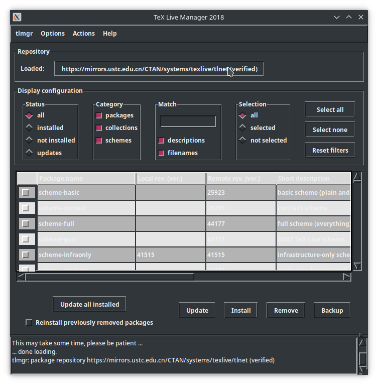
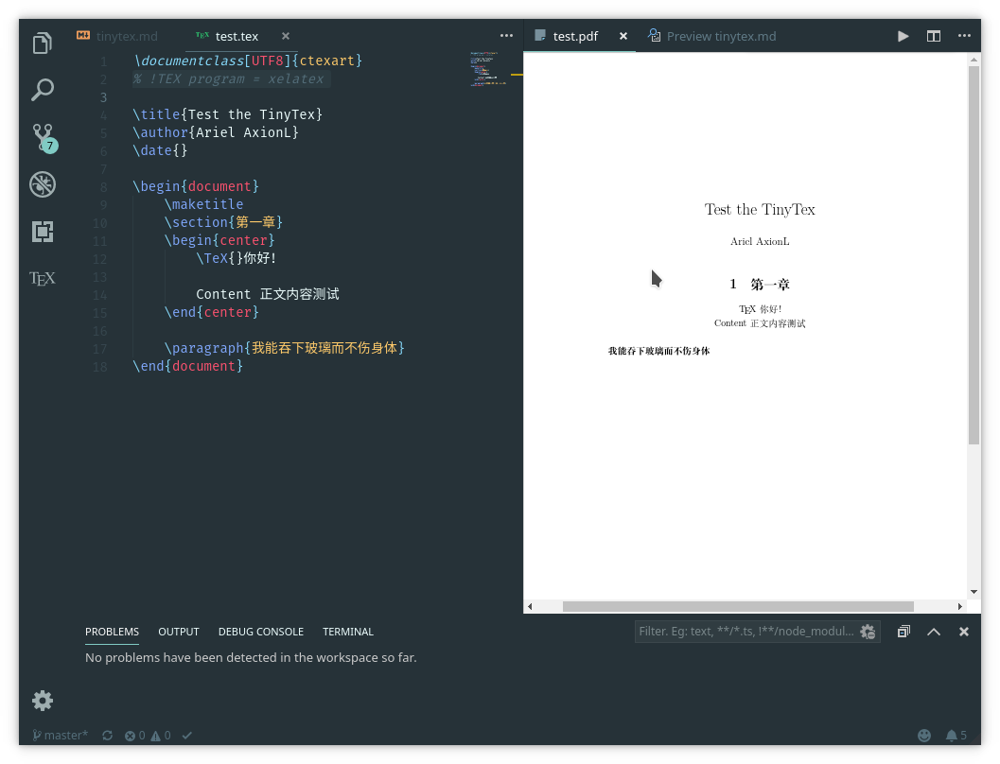

`TinyTeX` 是 yihui 制作的一款基于 TeX Live 的轻量级、跨平台、简单易用的 LaTeX 发行版。与安装占用空间庞大的完整版相比，TinyTex 按需所取、大幅精简，用 `tlmgr` 包管理器安装所需依赖即可基本使用。

## 项目链接

> [Github](https://github.com/yihui/tinytex) | 
> [文档](https://yihui.name/tinytex/)

## 安装 TinyTex

### 从 R 语言终端安装

初始化 R 语言环境设置，主要是修改软件源方便后续下载，这部分参考 [Arch Wiki](https://wiki.archlinux.org/index.php/R)。

```bash
$ sudo pacman -S r
$ touch ~/.Renviron ~/.Rprofile # 创建两配置文件内容如下
```

- `.Renviron`

```ini
R_HOME_USER = /path/to/your/r/directory # 设置你自己的目标路径，下同
R_PROFILE_USER = ${HOME}/.config/r/.Rprofile
R_LIBS_USER = /path/to/your/r/library
R_HISTFILE = /path/to/your/filename.Rhistory                                             # Do not forget to append the .Rhistory
MYSQL_HOME = /var/lib/mysql
```

- `.Rprofile`

```r
# The .First function is called after everything else in .Rprofile is executed
.First <- function() {
  # Print a welcome message
  message("Welcome back ", Sys.getenv("USER"),"!\n","working directory is:", getwd())
}

options(digits = 12)                                          # number of digits to print. Default is 7, max is 15
options(stringsAsFactors = FALSE)                             # Disable default conversion of character strings to factors
options(show.signif.stars = FALSE)                            # Don't show stars indicating statistical significance in model outputs
error <- quote(dump.frames("${R_HOME_USER}/testdump", TRUE))  # post-mortem debugging facilities

options("repos" = c(CRAN="https://mirrors.tuna.tsinghua.edu.cn/CRAN/")) # 换用 tuna 源
```

如果不在配置文件中修改源的话，接下来在交互模式内，第一次安装包的时候也会出现一个窗口需要你来选择源。由于弹出窗口是 `tk` 实现的，所以需手动安装其作为依赖。如果第一次安装选择错误，那么可以进入交互模式后输入 `chooseCRANmirror()` 来修改，如提示所言，退出交互模式为 `q()`，并且会问你是否保存会话。

在命令行输入 R，进入交互模式
```r
$ R

R version 3.5.2 (2018-12-20) -- "Eggshell Igloo"
Copyright (C) 2018 The R Foundation for Statistical Computing
Platform: x86_64-pc-linux-gnu (64-bit)
R is free software and comes with ABSOLUTELY NO WARRANTY.
You are welcome to redistribute it under certain conditions.
Type 'license()' or 'licence()' for distribution details.
Natural language support but running in an English locale
R is a collaborative project with many contributors.
Type 'contributors()' for more information and
'citation()' on how to cite R or R packages in publications.
Type 'demo()' for some demos, 'help()' for on-line help, or
'help.start()' for an HTML browser interface to help.
Type 'q()' to quit R.

> install.packages('tinytex') # 安装 tinytex
> tinytex::install_tinytex()
```

如果使用非管理员权限安装的话，会出现以下提示，输入 `yes` 即将写入目录置于用户家目录下。

```r
> install.packages('tinytex')
Warning in install.packages("tinytex") :
'lib = "/usr/lib/R/library"' is not writable
Would you like to use a personal library instead? (yes/No/cancel)
```

如果你看的是[中文文档](https://yihui.name/tinytex/cn/)的话，其中默认使用了 `devtools` 这个包，你需要自己先手动安装，即 `install.packages('devtools')`，无特殊需求则等待安装结束。

### 从脚本安装

```shell
wget -qO- "https://yihui.name/gh/tinytex/tools/install-unx.sh" | sh
```

### 添加环境变量

安装完成之后会在 `$HOME` 目录下出现一个 `.TinyTeX` 的文件夹，并且将其中的二进制软链接到了 `$HOME/bin`，你需要将这个文件夹添加到自己的 `$PATH` 中才可正常使用 `tlmgr` 等一系列工具。环境变量生效之后，TinyTeX 安装部分至此结束。

## 中文常用软件包配置

对于中文用户常用的包有 `ctex`、`xecjk`、`cjk`、`cjkpunct`、`fandol` 等，如果是直接用脚本安装的话可能需要手动装更多依赖，如果不确定要装什么包的话可以先找个简单的示例文档进行编译和预览，再根据报错提示来安装缺失的依赖包。

`tlmgr --gui` 提供了一个简易的图形界面用于软件包安装和配置。



也使用 R 语言提供的交互式命令行安装：

```r
tlmgr_install('PackageName')
```

或直接在命令行安装：

```r
tlmgr install 'PackageName' # 安装
```

## VSCode 配置

[LaTeX Workshop](https://marketplace.visualstudio.com/items?itemName=James-Yu.latex-workshop) 插件提供 LaTeX 渲染、高亮和补全支持，可以在扩展商店中搜索安装。



预览效果如上，其默认编译器的 `pdflatex` 对 `ctex` 中文包支持不是很好，建议参考照官方文档说明，在文档中添加 `% !TEX program = xelatex` ( Magic comment)，使用 xelatex 作为指定编译器。

其余 LaTeX 具体书写语法可参见 [TUNA 的演示文档](https://tuna.moe/assets/slides/latex-talk-v2.0.pdf)。