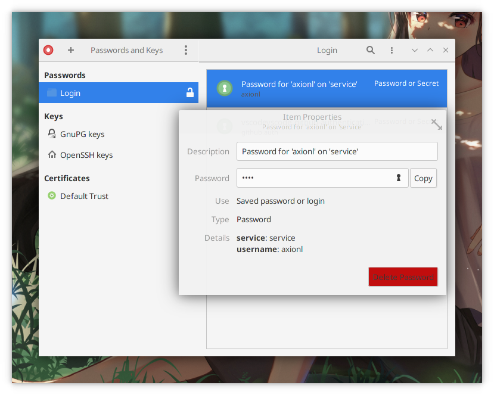

## 前言

> 项目地址：[twpayne/chezmoi](https://github.com/twpayne/chezmoi)

早前看了 Farseerfc 老师这篇译文，开始用 Stow 打理自己家目录中的配置文件，其实现非常简单直接：在一个特定的目录保留原始配置文件，并在其原本对应的位置创建软链接。

> [【譯】使用 GNU stow 管理你的點文件 ](https://farseerfc.me/using-gnu-stow-to-manage-your-dotfiles.html)

相比之下，其有如下缺点促使我切换到 Chezmoi:

- 需要手动创建目录结构，而不是根据现有配置文件来生成
- 需要手动建立版本管理，本身不提供备份和恢复等功能
- 2.3.0 版本加入了隐藏文件显式命名的方案，但还是需要手动添加 `dot-` 前缀
- 隐私数据加密

## 安装

> https://www.chezmoi.io/docs/install/

多数包管理器可以搜索到此包进行安装，包括 Linux、BSD、macOS、Windows 在内的多种平台。

```fish
$ curl -sfL https://git.io/chezmoi | sh
```

## 快速上手

### 初始化

```fish
$ chezmoi init --apply
```

这会在 `~/.local/share/chezmoi` 中创建一个目录权限为 `700` 的 git 仓库，用于保存配置文件。

- `$ chezmoi source-path` 可以列出其路径
- `$ chezmoi cd` 可以直接进入到该目录
- `--apply` 参数意为仓库创建后自动添加配置文件，默认为不创建
- `$ chezmoi init <git_repo>` 可在新设备上初始化上传的配置仓库

若包管理器未安装自动补全，则可由下例所示，添加到 <bash/zsh/fish/powershell> 配置当中。

```fish
$ chezmoi completion fish > ~/.config/fish/completions/chezmoi.fish
```

- `-o <filename>` 输出到文件，默认为标准输出

### 添加文件或目录

```fish
$ chezmoi add .nanorc # 添加文件
$ chezmoi add -x .config/fish/functions/ # 添加文件夹
$ chezmoi add -xa .config/fish/functions # 递归添加文件夹和子目录下的全部内容
$ chezmoi add -T .xprofile # 添加临时内容
$ chezmoi add .tmux.conf --follow # 添加软链接对应的原始内容，而不是软链接符号
$ chezmoi managed # 列出所管理的内容路径
```

### 编辑和应用

```fish
$ chezmoi edit ~/.bashrc --apply
```

- 其默认不带 `--apply` 参数，所以编辑完成后也不会直接作用于源文件，`--dry-run` 参数可以空运行而不改变目标文件
- `$EDITOR` 环境变量决定所使用的编辑器。
- `$ chezmoi diff` 以查看改动
- `$ chezmoi -v apply` 应用改动

### 同步与合并

```fish
$ chezmoi source pull -- --rebase && chezmoi diff
$ chezmoi apply --verbose
```

其同步操作与 git 本身无异，通过 `--` 可以传递所需参数。

```fish
$ chezmoi source add .nanorc
$ chezmoi source commit -- -m "Initial commit"
```

支持自动提交，但考虑到用户可能意外添加**敏感数据**的情况下不建议开启，配置文件的介绍将在稍后提到。

```toml
# ~/.config/chezmoi/chezmoi.toml

[sourceVCS]
    autoCommit = true
    autoPush = false
```

也可以一次打包成压缩包放 U 盘上硬件备份

```fish
$ chezmoi archive --output=dotfiles.tar
```

### 小结


其还提供了一个名为 `secret` 的参数，是各种加密存储管理软件命令行客户端的包装 (cli wrapper)，`chezmoi doctor` 可以检测机器中对应可执行文件的安装状态，此部分内容和应用会在后面的数据模板中提及。

至此，快速上手基本功能已介绍完毕，初次使用发现它像是一个功能丰富的 wrapper，提供了诸多自动化的帮助，包括编辑、冲突合并、同步和导出备份等。可以注意到一个与其他以软链接形式的 dotfiles manager 不同，由于在设计之初就考虑到了多设备、跨平台的兼容方案，chezmoi 并没有选择以软链接的形式来替换源文档所在路径，一方面提供了改动与应用之间的缓冲，另一方面规避了多平台的兼容性问题。

## 数据模板

以 [Hugo](https://gohugo.io/templates/) 作为博客或者使用过 [go template](https://pkg.go.dev/text/template) 的朋友一定不会对此感到陌生，得益于 `golang` 的实现，chezmoi 不仅做到了单文件、跨平台使用，还继承了其强大的数据模板功能，可以对于不同的设备实现不同的数据配置，比如配置不同的 `ssh key`，这也是与诸多的 dotfiles manager 的不同之处。

### 创建模板

以 `.gitconfig` 为例，原文如下：

```toml
[user]
    name = axionl
    email = axionl@example.com
```

为了在不同的设备电脑上使用不同的 git 账户这一需求，要将其中的用户信息数据与配置文件进行绑定，而原文件将作为 `.tmpl` 为后缀的模板文件保存。

```toml
# ~/.local/share/chezmoi/dot_gitconfig.tmpl
[user]
    name = "{{ .name }}"
    email = "{{ .email }}"
```

模板文件如上，`{{ }}` 是 go template 的数据变量标记符，`.` 代表了当前变量，即在非循环体内，`.` 就代表了传入的那个变量。一般的变量定义可由赋值表达式定义 `{{ $variable := Balabala }}`，不过这里 chezmoi 会根据配置文件自动生成和对应。

```fish
$ chezmoi add --autotemplate ~/.gitconfig
```

chezmoi 提供了自动生成模板的功能，但是聪明的生成器未必懂你心意，正如我的 hostname 恰好等于 username 而在其他机器上未必如此。


此时重新 `$ chezmoi edit ~/.gitconfig` 对应编辑的就是模板文件（就不要图快加上 `--apply` 了，以免产生不必要的手滑）。`$ chezmoi data` 的内容便是其妄加猜测的根源，对应变量也可以手动添加使用，如下，根据系统类型来判断模板中的内容是否作用于该机器，`-` 符号用于移除前或者后的空格，更多语法可去 [go template](https://golang.org/pkg/text/template/) 参阅。

```go-text-template
# ~/.local/share/chezmoi/dot_gitconfig.tmpl
{{ if eq .chezmoi.os "linux" -}}
[core]
    editor = nvim
{{ else }}
[core]
    editor = {{ .github.editor }}
{{ end -}}
```

对于大量需要编辑内容的配置文件，也可根据不同机器直接做多份同名文件，并对应进行切换。

```go-text-template
# symlink_dot_bashrc.tmpl
.bashrc_{{ .chezmoi.os }}
```

这将会创建一个 `~/.bashrc` 的软链接到对应的配置文件, 若不希望以软链接形式，`{{ include ".bashrc_linux" }}` 可以直接替换为文件。`.chezmoiignore` 用于确保对应的系统安装对应的文件，意为如果不匹配，则忽略对应的配置文件，此外还有 `.chezmoiremove` 等，详见 [reference](https://www.chezmoi.io/docs/reference/#chezmoiignore)。

```go-text-template
# .chezmoiignore
{{ if ne .chezmoi.os "darwin" }}
.bashrc_darwin
{{ end }}
{{ if ne .chezmoi.os "linux" }}
.bashrc_linux
{{ end }}
```

在配置文件内写入对应的数据，TOML 语法可去 [toml.io](https://toml.io/) 快速上手，大有（声）裨（安）益（利）。除此之外，chezmoi 还支持由 [github.com/spf13/viper](https://github.com/spf13/viper) 的 `json`, `hcl`, `yaml` 等格式，均以 chezmoi 加不同扩展名命名，将会使用第一个被找到的配置文件。

> [配置文件模板](https://www.chezmoi.io/docs/reference/#configuration-file)

```toml
# ~/.config/chezmoi/chezmoi.toml
[data]

[data.github]
editor = "nano"
```

如下命令可临时调试时，脱离模板文件查看变量值是否正确。

```fish
$ chezmoi execute-template '{{- .github.editor -}}'
nano⏎
```

### 编辑配置

相比于自动创建模板的南辕北辙，通过智能人工从模板中自动生成 TOML 配置则显得较为靠谱。

```go-text-template
# ~/test.tmpl
{{- $email := promptString "email" -}}
[data]
    email = "{{ $email }}"
```

通过 `promptString` 这个函数解析等下从命令行中传入的参数，并传入到配置文件中。

```fish
$ chezmoi execute-template --init --promptString email=axionl@example.com < ~/test.tmpl

[data]
    email = "axionl@example.com"
```

### 管理私有数据

chezmoi 通过检测原有目录和文件权限来判断是否属于私有，通常以 `private_` 为前缀， `0644` 为权限，`~/.local/share/chezmoi` 则为 `700` 权限，并且运行时会检查该文件夹权限是否正确。

以下面三种方式为例，介绍 chezmoi 的加密部分：

- GPG
- Gnome Keyring
- KeepassXC

其余还有 Lastpass, OnePassword 等[用法](https://www.chezmoi.io/docs/how-to/)。

#### GPG

支持对称和非对称密钥加密两种方式。

非对称加密方式中，可用如下命令查看接受方名称，所用 shell 支持的话也可以 `$ gpg --recipient <Tab>` 进行补全。

```fish
$ gpg --list-public-keys
pub   ed25519 2019-07-04 [SC] [expires: 2024-07-02]
      1FDBDCE2D26BD8F100EE2E73B1B9AAD8BE7E7326
uid           [ultimate] ArielAxionL <i@axionl.me>
```

以接受方竟是我自己为例，在配置文件 `chezmoi.toml` 中填入：

```toml
# ~/.config/chezmoi/chezmoi.toml
[gpg]
    recipient = "ArielAxionL"
```

将文件加密并添加，chezmoi 默认使用了 `gpg --armor` 参数使得加密文件可读，可以通过配置中，的 `command` 字段来定义 gpg 的其他参数。

```fish
$ chezmoi add --encrypt test.toml
```

 

对称加密：

```toml
# ~/.config/chezmoi/chezmoi.toml

[gpg]
    symmetric = true
```

#### Gnome Keyring

> [github.com/zalando/go-keyring](https://github.com/zalando/go-keyring)

Linux 中环境下，keyring 的实现目前还只支持 gnome-keyring，希望以后也能提供 kwallet 版本的接口。macOS 则支持 Keychain 存储帐号密码。

```fish
$ chezmoi secret keyring set --service=github --user=<github-user>
Password: <github-token>
```

将 `set` 替换成 `get` 从命令行拿到所存密令，或者使用 [Seahorse](https://wiki.gnome.org/Apps/Seahorse) 客户端查看。



```go-text-template
# ~/.local/share/chezmoi/dot_gitconfig.tmpl

[github]
    user = "{{ .github.user }}"
    token = "{{ keyring "github" .github.user }}"
```

`chezmoi.toml` 配置文件中写明用户名，模板中便可自动取用 gnome-keyring 先前所存 token，keyring 一般会在用户登陆时自动解锁 [GNOME/Keyring](https://wiki.archlinux.org/index.php/GNOME/Keyring)。

### KeepassXC

配置文件

```toml
# ~/.config/chezmoi/chezmoi.toml

[keepassxc]
    args = ["--key-file", "/path/to/your/key"]
    database = "/path/to/your/kdbx"
```

默认字段有 `Notes`, `Password`, `URL`, `Username`, 测试获得密码字段，Entry 可以填入保存密码的 Title，keepassxc-cli 会返回一个匹配的结果。

```fish
$ chezmoi execute-template '{{ (keepassxc "<YourEntry>").Password }}'
```

KeepassXC 支持自定义字段，比如你的密钥：


在模板中用 `keepassxcAttribute` 获取：

```fish
$ chezmoi execute-template '{{ keepassxcAttribute "VPS Keyring" "public-key" }}'
```

## 结束

得益于数据模板的引入，chezmoi 作为一款 dotfiles manager，其配置管理功能相较之下更加强大，也有更多新的功能和应用场景可以发掘。
