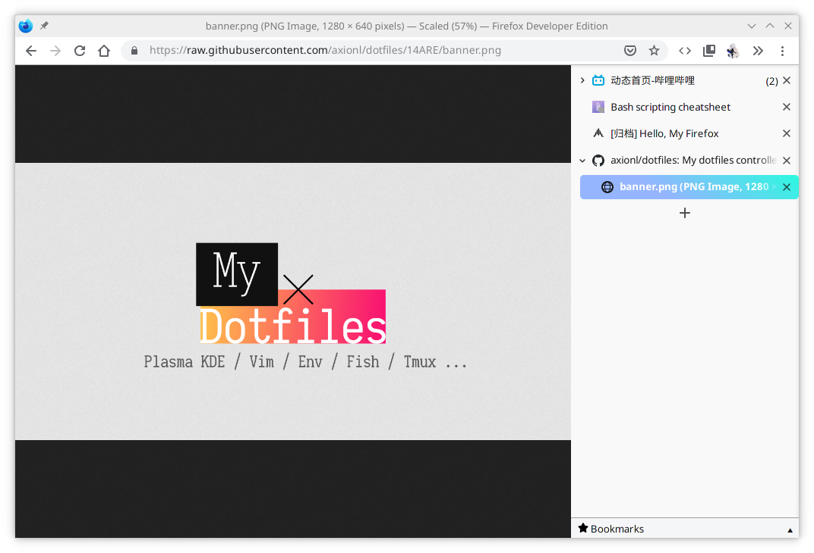
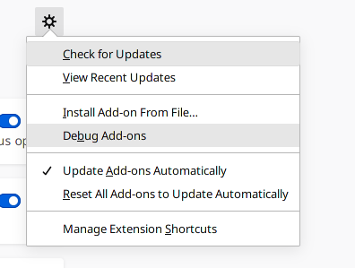
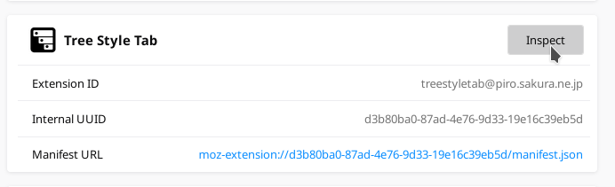
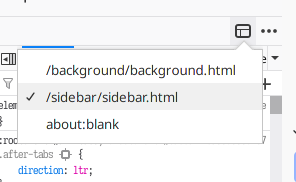
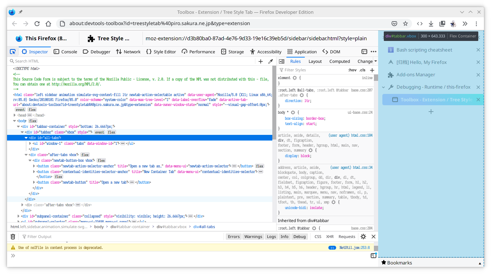
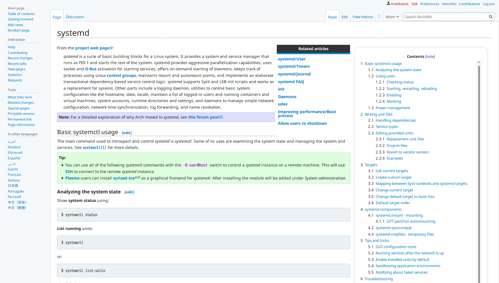

> 自用配置项，持续更新中......

## 选项

- 允许加载用户样式文件（userChrome.css）

```ini
toolkit.legacyUserProfileCustomizations.stylesheets = true
```

- 调整浏览器标签宽度

```ini
browser.tabs.tabClipWidth = 83
```

- 硬件加速

```ini
media.ffmpeg.vaapi.enabled = true
media.ffvpx.enabled = false
```

配合系统环境变量使用 `MOZ_X11_EGL=1` 或 `MOZ_ENABLE_WAYLAND=1`，`MOZ_WEBRENDER=1`

- Devtools

```ini
devtools.editor.tabsize = 4
devtools.debugger.remote-enabled = true
```

DevTools 中还有 `Enable browser chrome and add-on debugging toolboxes` 可以打开，调试扩展常用选项

- 易用模式

```ini
accessibility.typeaheadfind.enablesound = false
```

默认开了这个选项，导致 Ctrl+F 搜索不到结果的时候笔记本的蜂鸣器会吼得很大声

## 主题


> [MaterialFox](https://github.com/muckSponge/MaterialFox)

## 扩展

- [Tree Style Tab](https://addons.mozilla.org/en-US/firefox/addon/tree-style-tab)

  

  - userChrome.css 外部配置 [treestyletab.css](https://github.com/axionl/dotfiles/blob/14ARE/private_dot_mozilla/csstheme/TreeStyleTab/treestyletab.css)

  - 插件内嵌样式配置 [custom.css](https://github.com/axionl/dotfiles/blob/14ARE/private_dot_mozilla/csstheme/TreeStyleTab/custom.css)

  - 调试插件样式的方法

    1. 
    2. 
    3. 
    4. 

- [TST Bookmarks Subpanel](https://addons.mozilla.org/en-US/firefox/addon/tst-bookmarks-subpanel)

  

- [SwitchyOmega](https://addons.mozilla.org/en-US/firefox/addon/switchyomega)

  

- [Auto Tab Discard](https://addons.mozilla.org/zh-CN/firefox/addon/auto-tab-discard)

- [Keepassxc Browser](https://addons.mozilla.org/en-US/firefox/addon/keepassxc-browser)


- [Plasma Integration](https://addons.mozilla.org/en-US/firefox/addon/plasma-integration)


- [Saladict](https://addons.mozilla.org/en-US/firefox/addon/ext-saladict)

  

- [Tampermonkey](https://addons.mozilla.org/en-US/firefox/addon/tampermonkey)

  

  - 一个用于 [ArchWiki 目录](https://github.com/axionl/dotfiles/blob/14ARE/private_dot_mozilla/csstheme/Tampermonkey/archwiki.js) 侧边显示的脚本

  

- [User-Agent Switcher and Manager](https://addons.mozilla.org/en-US/firefox/addon/user-agent-string-switcher)

  
