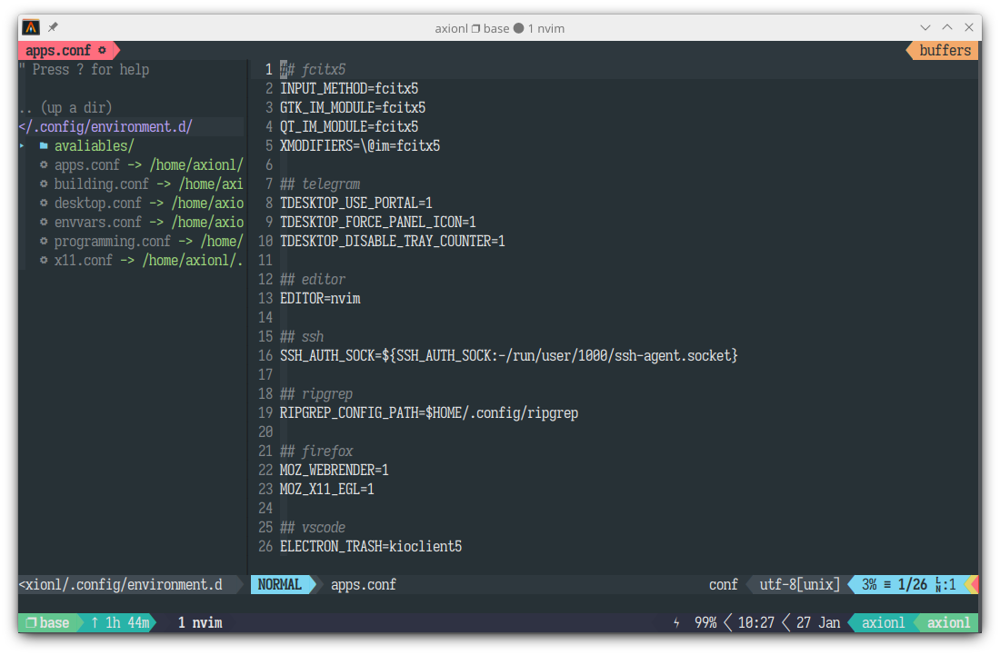
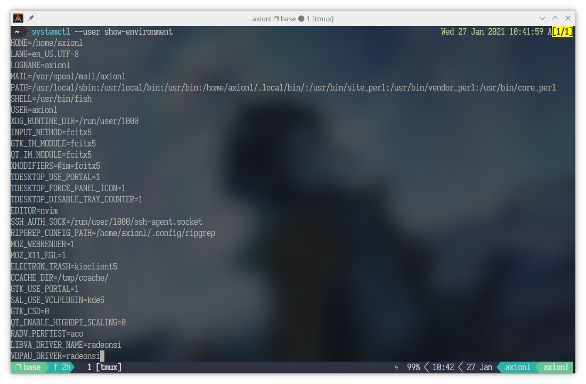

## 序言

Linux 下的用户环境变量配置常显得十分琐碎，如 .xprofile、.pam_environment 亦或是各种 shell 配置文件。

- .xprofile 受限于 x11 服务，在 wayland 或未启动图形界面等情况下不会被读取。
- .pam_environment 由于提权漏洞频出（如：[CVE-2010-4708](https://cve.mitre.org/cgi-bin/cvename.cgi?name=CVE-2010-4708)、[CVE-2011-3148](https://nvd.nist.gov/vuln/detail/CVE-2011-3148)），**已经被上游遗弃**，一些发行版为了兼容老的用户配置，在 /etc/pam.d/system-login 中临时加入 `session required pam_env.so user_readenv=1 ` 以恢复读取该文件中环境变量的行为，并非长久之计。

参考了依云的 [Linux 的环境变量怎么设](https://blog.lilydjwg.me/2020/7/22/linux-environment-variables.215496.html) 一文，遂选用 systemd 的 [environment.d](https://www.freedesktop.org/software/systemd/man/environment.d.html) 作为用户环境变量配置方案。

## 介绍

配置文件目录如下：

- ~/.config/environment.d/\*.conf [✓]
- /run/environment.d/\*.conf
- /etc/environment.d/\*.conf
- /usr/lib/environment.d/\*.conf
- /etc/environment

其写法如下：

- 环境变量=值
- 环境变量=${值:-如果为空的默认值}
- 环境变量=${值:+添加值}
- 可以读取 `$HOME`, `$PATH` 等原有的环境变量，如：`PATH=~/.local/bin:$PATH`



由于我是 fish + tmux 用户，需要自己导出一下生成的环境变量文件到命令行。

`~/.config/fish/conf.d/env_init.fish`

```fish
if not contains $PATH $USER
    export (/usr/lib/systemd/user-environment-generators/30-systemd-environment-d-generator)
end
```



## 关于 KDE/Plasma 的补充

>[Plasma and the systemd startup](https://blog.davidedmundson.co.uk/blog/plasma-and-the-systemd-startup/)

在 Plasma 5.21 和 Systemd 246 以及后续更新版本中，可以使用 systemd 来启动和管理 KDE 服务。

其中一个好处在于：其环境变量可直接继承自 `environment.d` 而无需再手动设置 `systemd-environment-d-generator` 生成的环境变量。

启用后重启生效。

```fish
$ kwriteconfig5 --file startkderc --group General --key systemdBoot true
```


使用 Systemd 进行管理后可利用其 CGroups 限制资源分配和使用等诸多特性（或许可以给你的应用加上 cgproxy?），进一步细化和统一用户配置方案，再次感谢开发者为此做出的努力。

```fish
$ systemctl --user set-property app-telegramdesktop-b9317feb02e54b4c93dd1c97a06711a4.scope MemoryMax=1500M MemoryLimit=1G
$ systemctl --user status app-telegramdesktop-b9317feb02e54b4c93dd1c97a06711a4.scope
  ● app-telegramdesktop-b9317feb02e54b4c93dd1c97a06711a4.scope - Telegram Desktop
      Loaded: loaded (/usr/share/applications/telegramdesktop.desktop; transient)
    Transient: yes
      Drop-In: /run/user/1000/systemd/transient/app-telegramdesktop-b9317feb02e54b4c93dd1c97a06711a4.scope.d
              └─50-MemoryLimit.conf, 50-MemoryMax.conf
      Active: active (running) since Tue 2021-02-23 21:02:37 CST; 5min ago
      Tasks: 44 (limit: 18425)
      Memory: 351.0M (max: 1.4G limit: 1.0G)
      CPU: 20.056s
      CGroup: /user.slice/user-1000.slice/user@1000.service/app.slice/app-telegramdesktop-b9317feb02e54b4c93dd1c97a06711a4.scope
              └─15363 /usr/bin/telegram-desktop --
```