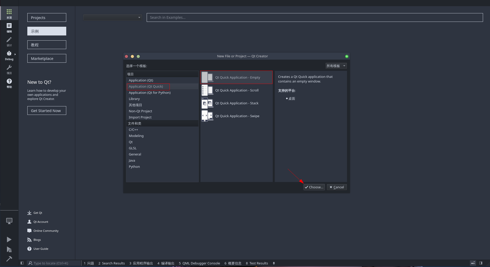
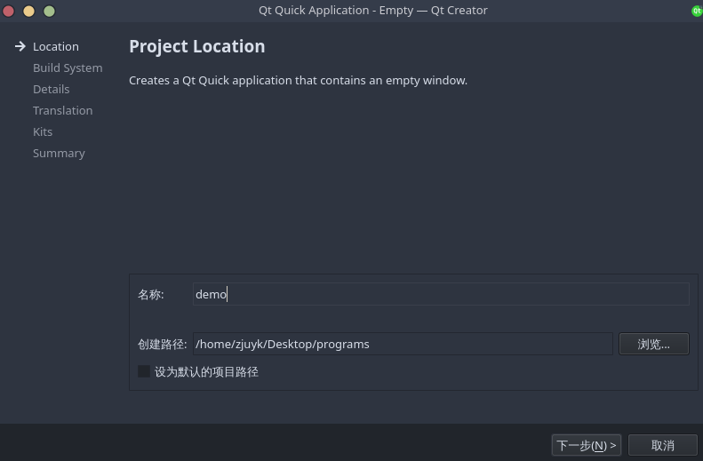
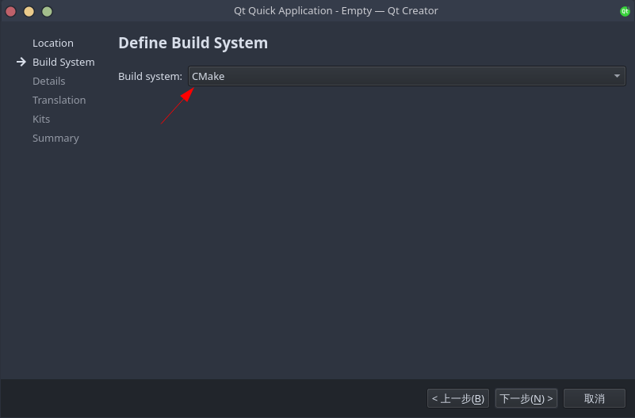
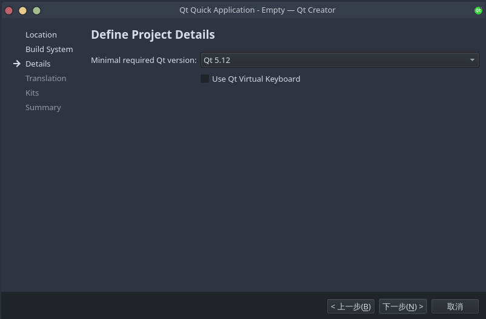
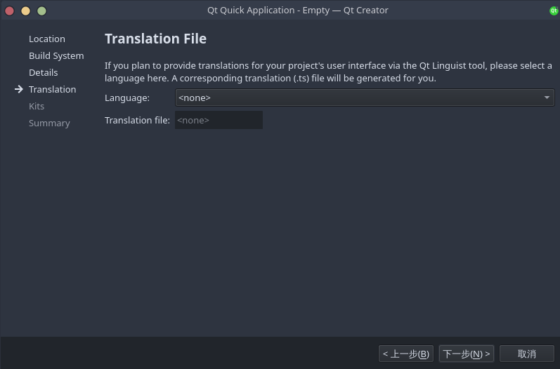
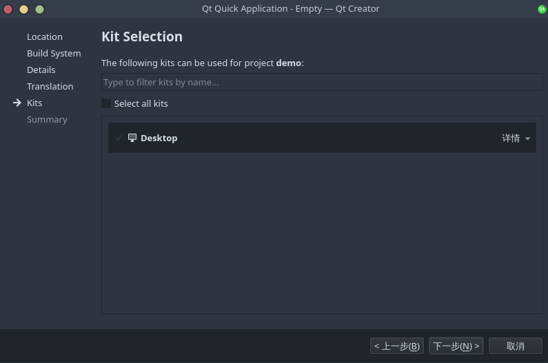
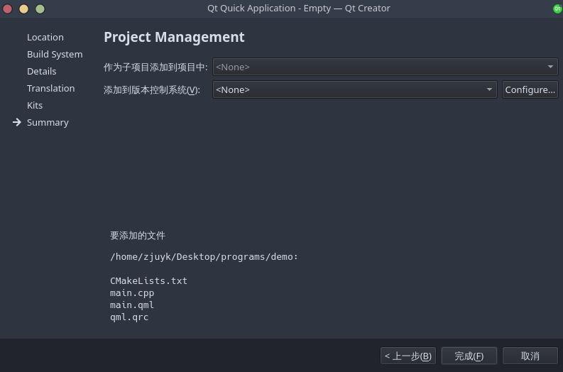
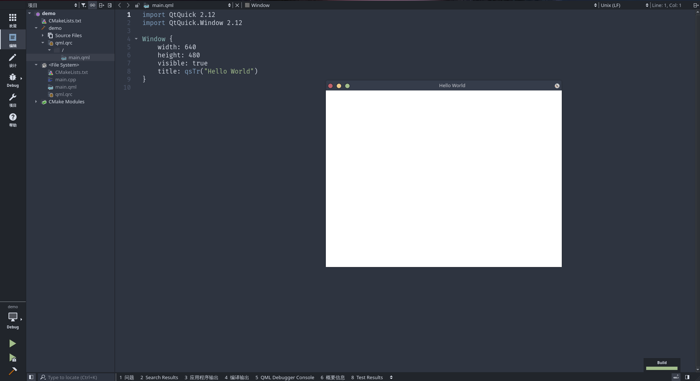

## 前言
> 项目地址: [axionl/OhMyQt](https://github.com/axionl/OhMyQt)

- 项目在 Windows 11 和 ArchLinux 下进行测试
- Qt 版本: 5.15.2

本文是 OhMyQt 系列的第 00 章节，主要介绍在 Windows 11 和 ArchLinux 下如何搭建一个可用的 Qt 开发环境。

## 在 ArchLinux 上搭建

### 基本软件安装

首先你需要安装 qt5-base，同时推荐安装对应的文档包 qt5-doc

```bash
$ sudo pacman -S qt5-base
$ sudo pacman -S qt5-doc # 可选
```

然后安装一个合用的编辑器，这里推荐使用 qtcreator

```bash
$ sudo pacman -S qtcreator
```

因为本教程主要是介绍 QML 的开发，所以还需要安装 qt5-declarative

```bash
$ sudo pacman -S qt5-declarative
```

安装完成之后验证版本信息

```bash
$ qmake -v
QMake version 3.1
Using Qt version 5.15.2 in /usr/lib

$ pacman -Qs qt5-declarative
local/qt5-declarative 5.15.2+kde+r29-1 (qt qt5)
    Classes for QML and JavaScript languages

$ qtcreator -version

Qt Creator 4.15.2 based on Qt 5.15.2
```

### 软件配置

首先打开 qtcreator，新建一个 QtQuick 项目



然后输入名称和路径



下一步编译系统建议选择 cmake



QT 版本保持默认



因为暂时是教学项目，暂时不添加语言文件



kit 保持默认的 Desktop 就好，因为我们最终也是要做一个桌面应用



会创建的文件如下所示，你也可以选择加入 git 作为版本控制



点击左下角的运行按钮，就可以看到运行的 HelloWorld 窗口了



恭喜你，已经搭建好了本教程的开发环境！

## 在 Windows 11 上搭建


