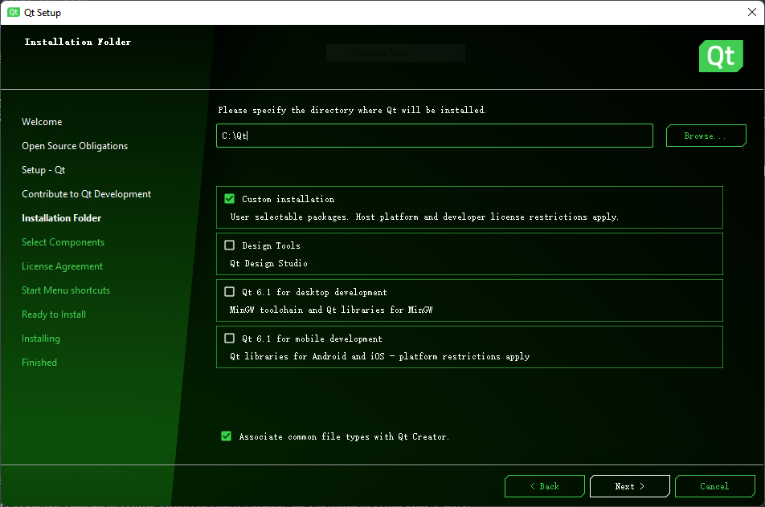
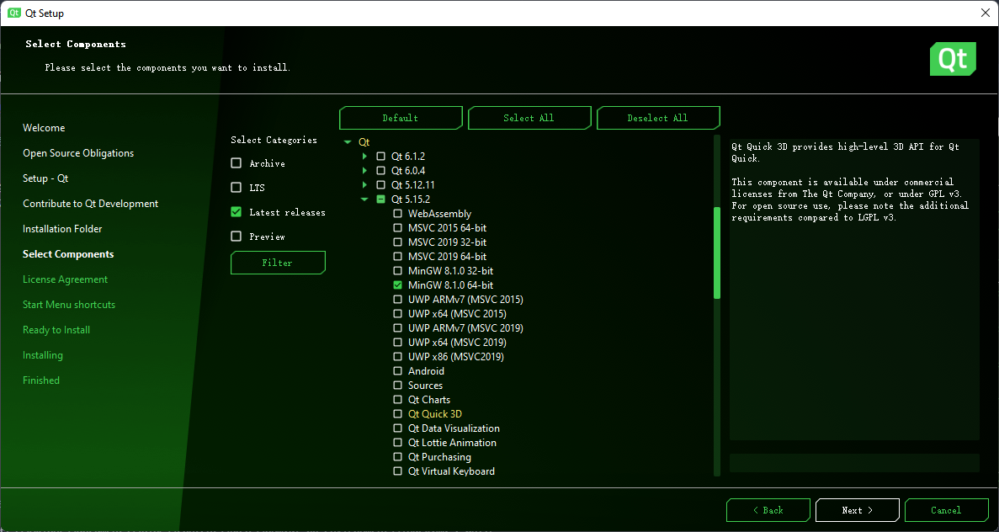
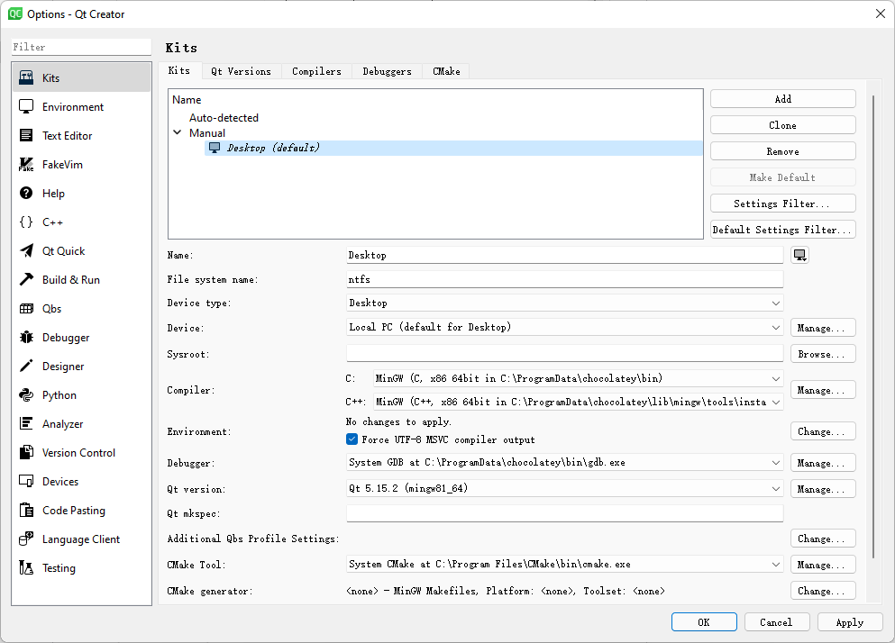
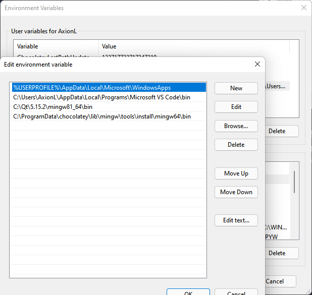

## 前言
> 项目地址: [axionl/OhMyQt](https://github.com/axionl/OhMyQt)

- 项目在 Windows 11 和 ArchLinux 下进行测试
- Qt 版本: 5.15.2

本文是 OhMyQt 系列的第 00 章节，主要介绍在 Windows 11 和 ArchLinux 下如何搭建一个可用的 Qt 开发环境。

## 在 ArchLinux 上搭建

### 基本软件安装

首先你需要安装 qt5-base，同时推荐安装对应的文档包 qt5-doc

```bash
$ sudo pacman -S qt5-base
$ sudo pacman -S qt5-doc # 可选
```

然后安装一个合用的编辑器，这里推荐使用 qtcreator

```bash
$ sudo pacman -S qtcreator
```

因为本教程主要是介绍 QML 的开发，所以还需要安装 qt5-declarative

```bash
$ sudo pacman -S qt5-declarative
```

安装完成之后验证版本信息

```bash
$ qmake -v
QMake version 3.1
Using Qt version 5.15.2 in /usr/lib

$ pacman -Qs qt5-declarative
local/qt5-declarative 5.15.2+kde+r29-1 (qt qt5)
    Classes for QML and JavaScript languages

$ qtcreator -version

Qt Creator 4.15.2 based on Qt 5.15.2
```

### 软件配置

首先打开 qtcreator，新建一个 QtQuick 项目


然后输入名称和路径


下一步编译系统建议选择 cmake


QT 版本保持默认


因为暂时是教学项目，暂时不添加语言文件


kit 保持默认的 Desktop 就好，因为我们最终也是要做一个桌面应用


会创建的文件如下所示，你也可以选择加入 git 作为版本控制


点击左下角的运行按钮，就可以看到运行的 HelloWorld 窗口了


恭喜你，已经搭建好了本教程的开发环境！

## 在 Windows 11 上搭建

### 通过 Installer 安装

> https://www.qt.io/download

注册账号并下载开源版本（需遵守 GPL 许可并限于个人使用）



**此处安装路径至今未支持带空格**，故不要选择常见的 `C:\Program Files` 等目录

手动最小化安装则选择 `Custom Installation`



至少需要选择一个版本的 Qt 支持（如 `MinGW 8.1.0 64-bit` 包含了 Qt 和其他所需的一些环境），而 `QtCreator` 作为 IDE 在下方已经被默认勾选了，还有 `CMake` 如果需要或是已经手动安装则可消去。等待联网装好后即可使用

### 通过第三方包管理器安装

`chocolately` 也提供了 [QtCreator](https://community.chocolatey.org/packages/qtcreator) 的安装脚本和基本的 [Qt5 SDK](https://community.chocolatey.org/packages/qt5-default) 环境

```PowerShell
choco install -y qt5-default qtcreato
```

脚本会自动下载安装，默认路径为 `C:\Qt`

### 配置工具链



QtCreator 左边 `Projects` 有配置工具链的地方，通常来说会自动检测是否已经安装对应工具并设置，如果需要自定义或者不在查找范围内的目录，则可以手动进行指定。

若在开发时终端需要运行 Qt 程序，则需要将库所在目录添加到环境变量 `PATH` 中（如 `C:\Qt\5.15.2\mingw81_64\bin`）



若是打包和分发的话则需要带上对应的动态链接库。

## 小结

Linux 平台上开发相对方便，而 Windows 平台上开发则受到没有合适包管理的限制，需要自己折腾一下。下一节将会正式开始教程中的第一个 Demo，一个用于展示自己内容的 Hello World 程序。