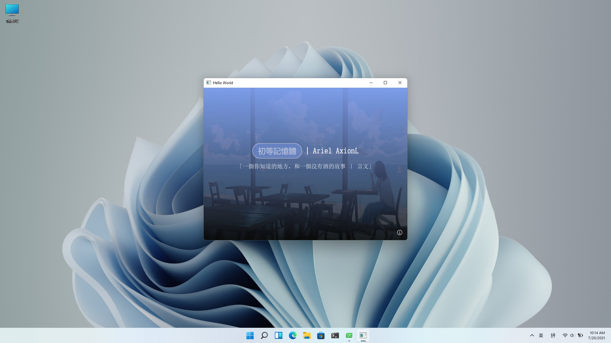
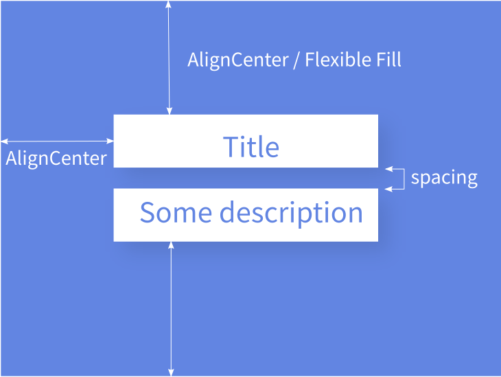
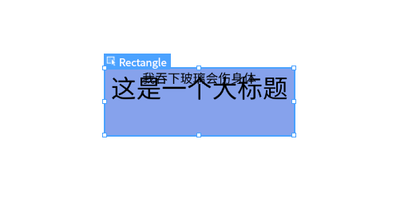
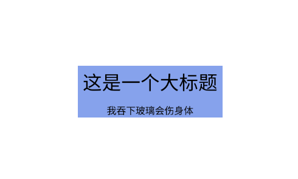
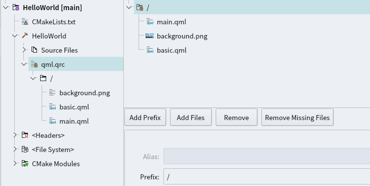
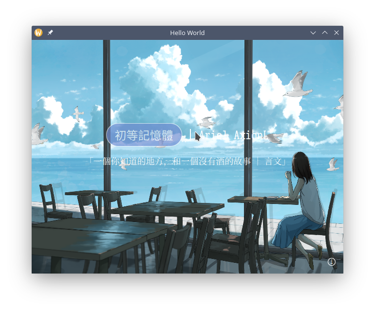

## 前言
> 项目地址: [axionl/OhMyQt](https://github.com/axionl/OhMyQt)

- 项目在 Windows 11 和 ArchLinux 下进行测试
- Qt 版本: 5.15.2

本文以项目构建的角度介绍一个简单 Qt 应用的开发，其余具体的环境安装和配置稍后会在第 0 节内容中放出。

## 从看见到设计

我们需要一个简单的展示页面作为上手的第一个项目：

- 一个醒目的标题
- 一段用于描述的文字
- 还有一个好看的背景

假设我们已经做了出来，它长下面这个样子，你需要做的是把它保留在你的想象中，我们再回过头来考虑如何实现。



### 布局

我们把窗口想象成一个盒子（而不是一个平面或者一张桌子，因为盒子横看有四壁，俯瞰有纵深），而所需要填入的内容当成另一个小些的盒子，套入到窗口这个大盒子中。结合我们多年糊 PPT 的水平，可以对界面有如下设计要求：

- 内容整体居中
- 标题和描述上下排布
- 内容之间最好有一定的间距



如上图所示，我们把这一些要求的集合称为 “布局” 也即 Layout，它决定了我们软件设计的基本框架。上面的每一项具体内容称为 “元素” 即 Element / Item。有的人设计 PPT 的时候会说：“应甲方要求，标题一定要大！”，那这属于元素的“属性”，即 Property。于是我们来抽象实现一下这个布局（**注意不是直接能用的代码**）：

```qml
// 基本元素如下
Window {                // 窗口一个大盒子
    Box {               // 里面套个小盒子
        Title {}        // 盒子里面有标题
        Description {}  // 标题下面有描述
    }
}
```

进一步加上居中对齐和间距：

```qml
Window {
    Box {
        anchors.centerIn: parent // 居中对齐大盒子

        Title {
            anchors.horizontalCenter: parent.horizontalCenter // 水平对齐小盒子
        }

        Description {
            anchors.horizontalCenter: parent.horizontalCenter // 水平对齐小盒子
        }
    }
}
```

可以看到，这里引用了一个 `parent` 的概念，实际上指代上一层父级元素，套娃套在里面的才是娃，文字和描述的父级元素是小盒子，小盒子的父级元素是大窗口。再补上元素的属性和间距：

```qml
Window {
    width: 960 // 窗口宽度
    height: 720  // 窗口高度

    Box {
        anchors.centerIn: parent
        implicitWidth: 360 // 宽度 360 单位（多数情况下理解为像素）
        implicitHeight: 128 // 高度 128 单位

        Title {
            anchors.horizontalCenter: parent.horizontalCenter // 水平对齐小盒子
            font.pixelSize: 24 // 标题一定要大
        }

        Box {
            visible: false      // 一个看不见的盒子
            implicitHeight: 16  // 用于拉开标题和描述的间距
        }

        Description {
            anchors.horizontalCenter: parent.horizontalCenter // 水平对齐小盒子
            font.pixelSize: 16 // 精致的描述用小字
        }
    }
}
```

这些具体元素我们以后会写到如何实现，现在需要用 `QtQuick.Controls` 提供的一些默认元素替代：

- Box->Rectangle
- Title / Description -> Text

```qml
import QtQuick 2.12
import QtQuick.Window 2.12
import QtQuick.Controls 2.12

Window {
    width: 960
    height: 720

    Rectangle {
        anchors.centerIn: parent
        implicitWidth: 360
        implicitHeight: 128
        color: "#ef7e9ceb"

        Text {
            id: title
            anchors.horizontalCenter: parent.horizontalCenter
            text: "这是一个大标题"
            font.pixelSize: 48
        }

        Rectangle {
            color: "transparent"
            implicitHeight: 16
        }

        Text {
            id: description
            anchors.horizontalCenter: parent.horizontalCenter
            text: "我吞下玻璃会伤身体"
            font.pixelSize: 24
        }
    }
}
```

实现之后的效果可能长成了这个样子，对了，但没全对。因为我们这个 `Rectangle` 不太智能，是个“硬盒”，元素之间会挤在一起，而不是自动拉开保持社交距离。



```qml
import QtQuick 2.12
import QtQuick.Window 2.12
import QtQuick.Controls 2.12
import QtQuick.Layouts 1.12

Window {
    width: 960
    height: 720

    Rectangle {
        anchors.centerIn: parent
        implicitWidth: 360
        implicitHeight: 128
        color: "#ef7e9ceb"

        ColumnLayout { // 一个上下布局的模板
            anchors.fill: parent // 沾满小盒子的空间
            spacing: 16 // 原先看不见的盒子用默认提供的间距属性实现

            Text {
                id: title
                Layout.alignment: Qt.AlignHCenter | Qt.AlignVCenter // 换成 Layout 下的居中对齐模式
                text: "这是一个大标题"
                font.pixelSize: 48
            }

            Text {
                id: description
                Layout.alignment: Qt.AlignHCenter | Qt.AlignVCenter
                text: "我吞下玻璃会伤身体"
                font.pixelSize: 24
            }
        }
    }
}
```

可以把 `ColumnLayout` 当作一个更加智能的盒子，它能够把挤在一起的元素上下依次排开。而与之相对的 `RowLayout` 则是将元素左右排开。



对比原本想像中的布局要求，可以说是基本实现了(~~打个九折不过分吧~~)。

### 样式

基本的元素提供了默认的样式和属性，回顾想象图目前还缺少：

- 按钮
- 背景图

以一个基本的矩形为例，有如下常用属性（[QtQuick-Rectangle](https://doc.qt.io/qt-5/qml-qtquick-rectangle.html)）

```qml
import QtQuick.Controls 2.12

Rectangle {
    width: 16
    height: 16
    radius: 8                  // 圆角半径
    color: "white"             // 颜色
    border.width: 1            // 边框宽度
    border.color: "whitesmoke" // 边框颜色
}
```

带阴影的矩形可以这样实现：

```qml
import QtQuick.Controls 2.12
import QtGraphicalEffects 1.0 // 包含 DropShadow 效果

Rectangle {
    // ...

    layer.enabled: true
    layer.effect: DropShadow {
        horizontalOffset: 1 // 横向偏移
        verticalOffset: 1   // 纵向偏移
        radius: 16          // 阴影半径
        samples: 17         // 采样率（越高效果越好，性能消耗也增大）
        color: "#10000000"  // ARGB（透明度，红，绿，蓝）
    }
}
```

为矩形添加渐变色：

```qml
Rectangle {
    // ...

    rotation: 0                 // 渐变角度
    gradient: Gradient {
        GradientStop {
            position: 0
            color: "#ef7e9ceb"  // 起始颜色
        }
        
        // 可以添加多段
        
        GradientStop {
            position: 1
            color: "#c5000000"  // 结束颜色
        }
    }
}
```

`qml.qrc` 文件中管理所有的静态资源，可以右键在编辑器中打开，然后添加图片资源：



```qml
Rectangle {
    id: background

    // ...

    Image {
        anchors.fill: background           // 填充背景矩形
        source: "qrc:/background.png"      // 图片资源
        fillMode: Image.PreserveAspectCrop // 填充方式
        z:-1  // 由于需要将渐变色作为滤镜效果，所以图片的层级下调
    }
}
```

如果去掉 z 轴高度设置会发现渐变色在图片下层不可见：



## 事件和交互

虽然 `QtQuick.Controls` 中提供了 `Button` 控件，但是我们仍然可以先为自己创立一个简单的按钮。

```qml
Rectangle {
    id: button
    implicitHeight: 48
    implicitWidth: 156
    radius: implicitHeight / 2
    border.color: "white"   // 边框颜色
    color: "#ef7e9ceb"      // 背景颜色

    Text {
        anchors.verticalCenter: parent.verticalCenter  // 居中对齐
        anchors.horizontalCenter: parent.horizontalCenter

        text: "初等記憶體"  // 文字内容
        color: "white"      // 文字颜色
    }

    // 覆盖全按键的鼠标动作区域
    MouseArea {
        anchors.fill: parent
        Layout.alignment: Qt.AlignHCenter | Qt.AlignVCenter
        hoverEnabled: true  // 允许响应鼠标停留

        onEntered: {
            parent.color = Qt.lighter(button.color, 0.8)  // 进入颜色变深
            parent.opacity = 1.0 // 不透明
        }

        onExited: {
            parent.color =  Qt.lighter(button.color, 0.9) // 退出颜色变浅
            parent.opacity = 0.7
        }

        onClicked: {
            parent.color =  Qt.lighter(button.color, 1.1) // 点击颜色变亮
        }
    }
}
```

这里有一个常见用法可以将需要设置的属性用 `property` 暴露出来，这样便于统一设置和更改，以及将来要写自己组件时便于外部设置，使用 `state` 可以提供若干个对象默认状态进行切换，这部分后面会见到。

```qml
Rectangle {
    // ...
    property string buttonColor: "#ef7e9ceb"
    property string buttonText

    color: buttonColor  // 引用属性值
}
```