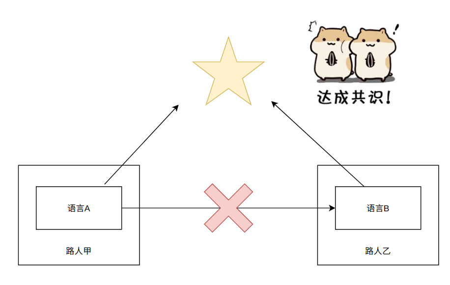
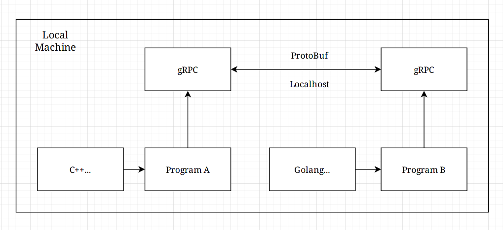
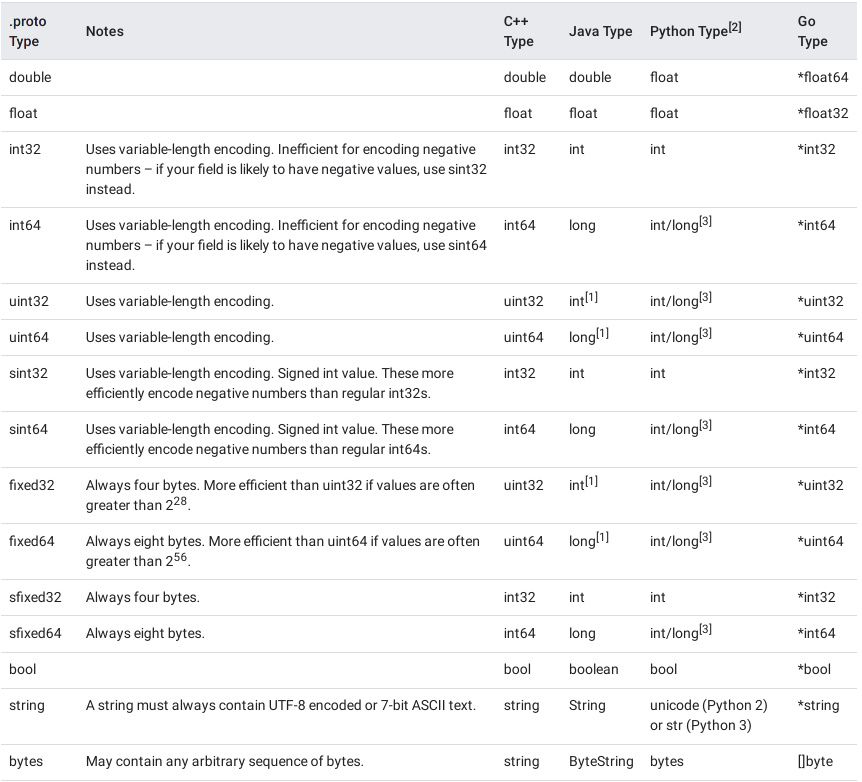

## 前言
> 官方网站
> - [gRPC](https://grpc.io)
> - [Protocol Buffers](https://developers.google.com/protocol-buffers)
 
### 通俗易懂的说明



以宽泛的概念来说就是找到一种公共的中间体，以达到两者“交流”的目的。

### 有点复杂的介绍

[RPC(Remote Procedure Call)](https://en.wikipedia.org/wiki/Remote_procedure_call) 远程过程调用，可简单理解为远程的程间通讯。gRPC 是 Google 所实现的一个开源框架，Protocol Buffers 是用于通信的数据载体格式，有着高压缩率（序列化后）、跨平台、多语言等优点。

虽然定义上是远程通讯，但扩展到仅本地使用就成了一种形式上的程间通讯。gRPC 通过网络栈实现这一过程，而 Apache Thrift 则包含了网络、命名管道、内存共享等多种数据交换形式，留作以后介绍和对比。通过序列化工具 (Protocol Buffers) 在节省带宽和减少传输时间的基础上，又能够轻易还原回原本的结构数据，便于多语言开发，部分软件也以此作为其 API 暴露方式，如 v2ray 等。



### 一个简单的例子
以一个消息内容为空的协议为例子，仅用于确认发送和响应。对于 `golang`	或者 `java` 等语言来说 `proto3` 支持以 `option` 的方式产生适合其代码引入的包封装 ([详见](https://developers.google.com/protocol-buffers/docs/tutorials))。

- 公共协议
```proto
syntax = "proto3";
option go_package = "example.com/user/grpcGoExample"

message HelloMessage {} // 公共消息体，未包含任何字段

/* 通讯服务声明，类似于我们常说的接口 */
service Greeter {
  rpc SayHello(HelloMessage) returns (HelloMessage);
}
```

- golang 客户端
```go
import (
	...
	pb "example.com/user/grpcGoExample"
)

// 具体方法实现
func (g *Greeter) sayHello() {
    // 生成上下文
	ctx, cancel := context.WithTimeout(context.Background(), time.Second)
	defer cancel()

    // 获取服务端响应，在执行这条指令后可以看到进入了服务端对应的方法
	response, err := g.client.SayHello(ctx, &pb.HelloMessage{})
	if err != nil {
		log.Fatalf("Failed to get the response: %v", err)
    }
	if response != nil {
		fmt.Print("Hello Server")
	}
}

func main() {
    // 本地临时创建一个不安全的链接(socks5)
    const Address = "localhost:50051"
	conn, err := grpc.Dial(Address, grpc.WithInsecure(), grpc.WithBlock())
	if err != nil {
		log.Fatalf("Failed to connect: %v", err)
	}
	defer conn.Close()

	var client = pb.NewGreeterClient(conn)
	greeter := Greeter{client: client}
	greeter.sayHello() // 调用方法
}
```

- 服务端
```go
import (
	...
	pb "example.com/user/grpcGoExample"
)

type server struct {
	pb.UnimplementedGreeterServer
}

// 方法具体实现
func (s *server) SayHello(ctx context.Context, message *pb.HelloMessage) (*pb.HelloMessage, error) {
    // 请求陷入该方法后输出字符串，表示服务器已经收到该指令
	log.Println("Hello Client!")

    // 返回响应
	return &pb.HelloMessage{}, nil
}

func main() {
    // 监听一个本地端口
	lis, err := net.Listen("tcp", "0.0.0.0:50051")
	if err != nil {
		log.Fatalf("failed to listen: %v", err)
	} else {
		log.Printf("Listen on: %v...", Address)
	}

    // 创建服务端
	s := grpc.NewServer()
	pb.RegisterGreeterServer(s, &server{})

	if err := s.Serve(lis); err != nil {
		log.Fatalf("failed to serve: %v", err)
	}
}

```

可以看到，在基本不需要涉及底层网络开发和同步协定的情况下实现了两个程序之间的通讯，其关键在于服务端重写方法的实现和客户端上下文的获取。在后续的介绍中还会就具体操作过程作详细说明。

## Protocol Buffers 简要

### 跨语言类型的桥梁
>[Protocol Buffers](https://developers.google.com/protocol-buffers)

作为一种语言中立的协议，其在多种语言中都有对应的变量类型转换，需要特别注意是否在转换过程中出现精度丢失现象，或者并非预期类型的现象，比如 `bytes` 对应到 `C++` 的类型为 `string`，需要自己适当转换。



此外支持通过嵌套类型，实现结构体形式的信息的传输和还原。

```protobuf
message PersonalInfo {
    int32 id = 1; 
    string name = 2;
    int32 score = 3;
    enum Hobby {
        GAMES = 1;
        MUSIC = 2;
    }
    Hobby hobby = 4;
}

message PersonalResponse {
	string msg = 1;
}

message ClassInfo {
	repeated PersonalInfo c_info = 1;
}

service SearchInfo {
	rpc Add(stream PersonalInfo) returns (PersonalResponse);
}
```

更多语法说明可以参考[官方文档](https://developers.google.com/protocol-buffers/docs/proto3)。

### 生成库文件
> [Protobuf Github Release 下载 (含 protoc)](https://github.com/protocolbuffers/protobuf/releases/latest)

生成所需要用到两个工具，一个是 `protoc` 其本身，另一个是用于生成对应其他语言文件的插件，后者可能有些发行版已经将对应语言的插件打包到了 `grpc` 包内一起，视具体情况而定，比如 `protoc-gen-go-grpc` 正好没有，那就找到[上游项目](https://github.com/grpc/grpc-go)自己安装一个并添加到环境变量中（方便输入）。

- 命令行方式

```fish
$ protoc --plugin=protoc-gen-go-grpc --go_out=. --go-grpc_out=. -I=. info.proto
```

然后生成了 `info.pb.go` 和 `info_grpc.pb.go` 两个文件，大体上看前者管定义，后者管实现，属于同一个包。其他语言主要是将二进制插件和输出参数替换成对应语言的。

- cmake 包办

可以参考如下两个 `.cmake` 文件，自己在 `CMakeLists.txt` 中设置变量名称。

```cmake
## protobuf.cmake
# Find Protobuf
find_package(Protobuf REQUIRED)

# Find Generator Executable
find_program(PROTOBUF_PROTOC_EXECUTABLE protoc)

# Set Proto Name
set(API_PROTO_NAME "<YourProtoName>")

# Set Libraries
set(PROTOBUF_LIBPROTOBUF_LIB protobuf::libprotobuf)

# Set Proto Path
get_filename_component(API_PROTO_PATH "protofile" ABSOLUTE)

# File Proto File
get_filename_component(API_PROTO "${API_PROTO_PATH}/${API_PROTO_NAME}.proto" ABSOLUTE)

# Generated Sources
protobuf_generate_cpp(API_PROTO_SRCS API_PROTO_HDRS "${API_PROTO}")
```
```cmake
## grpc.cmake
# Find gRPC Package
find_package(gRPC CONFIG REQUIRED)

# Find Generator Executable Plugin
find_program(GRPC_CC_PLUGIN_EXECUTABLE grpc_cpp_plugin)

# Find PkgConfig
find_package(PkgConfig REQUIRED)

# Check Modules
pkg_check_modules(GRPC REQUIRED grpc++ grpc)

# Set Source Files
set(API_GRPC_SRCS ${CMAKE_CURRENT_BINARY_DIR}/${API_PROTO_NAME}.grpc.pb.cc)
set(API_GRPC_HDRS ${CMAKE_CURRENT_BINARY_DIR}/${API_PROTO_NAME}.grpc.pb.h)

# Set Libraries
set(GRPC_GRPCPP_LIB gRPC::grpc++)
set(GRPC_REFLECTION_LIB gRPC::grpc++_reflection)

# Generate gRPC Sources
add_custom_command(
        OUTPUT "${API_GRPC_SRCS}" "${API_GRPC_HDRS}" "${API_PROTO_SRCS}" "${API_PROTO_HDRS}"
        COMMAND ${PROTOBUF_PROTOC_EXECUTABLE}
        ARGS --grpc_out=${CMAKE_CURRENT_BINARY_DIR}
            --cpp_out=${CMAKE_CURRENT_BINARY_DIR}
            -I="${API_PROTO_PATH}"
            --plugin=protoc-gen-grpc="${GRPC_CC_PLUGIN_EXECUTABLE}"
            "${API_PROTO}"
        DEPENDS "${API_PROTO}"
)
```

### 一个综合的案例

[v2ray config.proto](https://github.com/v2fly/v2ray-core/blob/master/config.proto)

```protobuf
syntax = "proto3";

package v2ray.core;
option csharp_namespace = "V2Ray.Core";
option go_package = "v2ray.com/core";
option java_package = "com.v2ray.core";
option java_multiple_files = true;

import "common/serial/typed_message.proto";
import "transport/config.proto";
...
```

可以看到首先引入了两个子 `proto` 文件，其中包含一些自己项目具体定义的消息类型，以 `typed_message.proto` 为例子，其中只包含了两种类型的两个字段。

```protobuf
message TypedMessage {
  // The name of the message type, retrieved from protobuf API.
  string type = 1;
  // Serialized proto message.
  bytes value = 2;
}
```
最终通过层层嵌套构成了一个综合的信息结构体，一并打包发送。

> [Banner Artwork](https://wallhaven.cc/w/6k293l)
