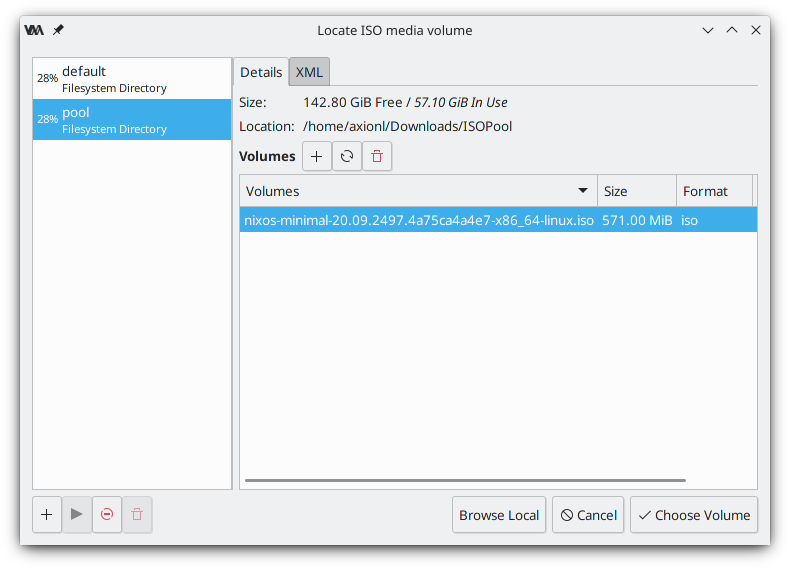
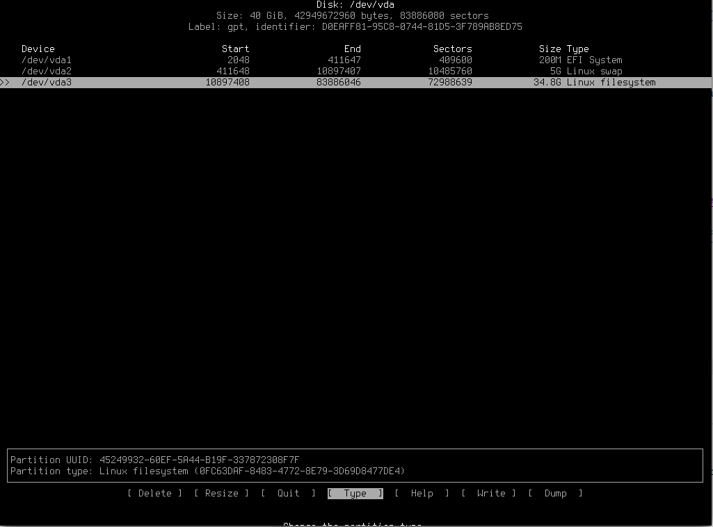

## 前言
2019 年 1 月的时候知道了这个发行版，当时 `@NixOS_zh` 群刚建立（~~后来这群凉了~~），就开虚拟机玩了一下，时隔多年发现又有不少人对其颇感兴趣，便决定重新写一下安装相关的教程。

**本文以 Arch Linux 作为宿主机，大体步骤与 Arch Wiki 相近**

## QEMU/KVM 虚拟机配置
> ArchLinux Wiki: [KVM](https://wiki.archlinux.org/index.php/KVM)
    | [QEMU](https://wiki.archlinux.org/index.php/QEMU)
    | [Libvirt](https://wiki.archlinux.org/index.php/Libvirt)

### 0. 检测硬件是否支持 KVM
一般情况下需要进入到 `BIOS` 对应页面打开虚拟化支持，常见对应设置项如下：
- AMD: SVM Support
- Intel: Intel Virtual Technology

开启虚拟化后在宿主机上用命令行检测（比如我的是 AMD 的处理器）：

```bash
$ LC_ALL=C lscpu | grep Virtualization
Virtualization:                  AMD-V
```
内核支持检测，如果使用的是 ArchLinux 提供的官方内核，即 `core/linux` 则已经包含了对应的 kvm 模块（`kvm`、`kvm_amd`或`kvm_intel`）:

```bash
$ zgrep CONFIG_KVM /proc/config.gz
CONFIG_KVM_GUEST=y
CONFIG_KVM_MMIO=y
CONFIG_KVM_ASYNC_PF=y
CONFIG_KVM_VFIO=y
CONFIG_KVM_GENERIC_DIRTYLOG_READ_PROTECT=y
CONFIG_KVM_COMPAT=y
CONFIG_KVM_XFER_TO_GUEST_WORK=y
CONFIG_KVM=m
CONFIG_KVM_INTEL=m
CONFIG_KVM_AMD=m # 可以看到有该模块
CONFIG_KVM_AMD_SEV=y
CONFIG_KVM_MMU_AUDIT=y
```

查看这些内核模块是否已自动加载：
```bash
$ lsmod |grep kvm
kvm_amd               114688  8
ccp                   118784  1 kvm_amd
kvm                   933888  1 kvm_amd
irqbypass              16384  1 kvm
```

如果没有自动加载则手动：
```bash
$ sudo modprobe kvm
$ sudo modprobe kvm_amd # 对应你的 CPU 类型
```

### 1. 准虚拟化（使用 VIRTIO）
检测 VIRTIO 模块是否可用：

```bash
$ zgrep VIRTIO /proc/config.gz
CONFIG_BLK_MQ_VIRTIO=y
CONFIG_VIRTIO_VSOCKETS=m
CONFIG_VIRTIO_VSOCKETS_COMMON=m
CONFIG_NET_9P_VIRTIO=m
CONFIG_VIRTIO_BLK=m
CONFIG_SCSI_VIRTIO=m
CONFIG_VIRTIO_NET=m
CONFIG_VIRTIO_CONSOLE=m
CONFIG_HW_RANDOM_VIRTIO=m
CONFIG_DRM_VIRTIO_GPU=m
CONFIG_VIRTIO=y
CONFIG_VIRTIO_MENU=y
CONFIG_VIRTIO_PCI=m
CONFIG_VIRTIO_PCI_LEGACY=y
CONFIG_VIRTIO_VDPA=m
CONFIG_VIRTIO_PMEM=m
CONFIG_VIRTIO_BALLOON=m
CONFIG_VIRTIO_MEM=m
CONFIG_VIRTIO_INPUT=m
CONFIG_VIRTIO_MMIO=m
CONFIG_VIRTIO_MMIO_CMDLINE_DEVICES=y
CONFIG_VIRTIO_DMA_SHARED_BUFFER=m
CONFIG_RPMSG_VIRTIO=m
CONFIG_VIRTIO_FS=m
CONFIG_CRYPTO_DEV_VIRTIO=m
```

准虚拟化设备列表（主要确保以下几个模块有对应开启，若未开启则手动用 `modprobe` 命令开启）：

- 网络设备 (virtio-net)
- 硬盘设备 (virtio-blk)
- 控制器设备 (virtio-scsi)

### 2. 安装 QEMU
```bash
$ sudo pacman -S qemu
```

> Arch Wiki: [PCI 直通](https://wiki.archlinux.org/index.php/PCI_passthrough_via_OVMF#Setting_up_IOMMU)

如果需要启用 PCI 直通功能则需要在内核参数中添加 `intel_iommu=on` 或者 `amd_iommu=on`，同时可以在其后添加 `iommu=pt`，以防前者失效，以下命令检测是否开启成功，由于本人所用 `AMD Ryzen 5 4600U` 支持方面还有些问题，故此不做展示。

```bash
$ sudo dmesg | grep -i -e DMAR -e IOMMU
```

### 3. 安装 libvirt
```bash
$ sudo pacman -S libvirt virt-manager dnsmasq edk2-ovmf
```

为了避免每次都需要询问 `root` 密码，建议将自己的用户添加到 `libvirt` 组：

```bash
$ sudo usermod -aG libvirt <YourUserName>
```

编辑服务端配置文件 `/etc/libvirt/libvirtd.conf`，取消如下几行的注释：

```config
unix_sock_group = "libvirt"
unix_sock_ro_perms = "0777"  # set to 0770 to deny on-group libvirt users
unix_sock_rw_perms = "0770"
auth_unix_ro = "none"
auth_unix_rw = "none"
```

同时添加 ipv4 的内核转发参数：
```bash
$ sudo echo 'net.ipv4.ip_forward = 1' >> /etc/sysctl.d/00-network.conf
```

设置开机启动和运行服务。
```bash
$ sudo systemctl enable --now libvirtd.service
```

### 4. 配置 virt-manager


建议重启以应用之前的设置，此时在 `Virtual Machine Manager` 的界面应该可以看到一些已经连接上的服务端，如果没有则在菜单栏自行添加，推荐初次连接系统级服务来创建虚拟机。


> [NixOS 镜像下载](https://nixos.org/download.html#nixos-iso)

将下载到的镜像文件**所在目录**创建为文件系统池，随后在其中选择镜像文件进行加载。

 

设置合适的系统资源和网络配置等（初次使用推荐用 `NAT` 模式较为简单，`Bridge` 模式之后会提到如何配置）。

 

如果你的宿主机支持的话，推荐使用 `UEFI` 模式启动（由 `extra/edk2-ovmf` 这个提供，中途安装的话要重启 `libvirtd` 服务以生效）。


调整镜像到启动优先级最高，最后启动工具栏上的 Begin Install 就可以安装了。


## NixOS 系统安装
> [NixOS 使用手册](https://nixos.org/manual/nixos/stable/)

### 0. 进入引导界面
 

由于我下载的是最小化镜像，所以并没有图形界面，如果下载的是带 `Gnome` 或者 `KDE` 的镜像的话应该可以看到界面了，稍后我也会以最小化镜像的方式开始安装图形界面。

### 1. 磁盘分区
查看当前块设备状态，可以看到我们之前分配的盘 `vda` 还未被挂载


建议使用 GPT 分区表，按照可以按照图中对 `boot`、`swap`(可选)和 `root` 分区进行创建，注意下方 `Type` 选择对应的分区类型，`Write` 写入后退出。

```bash
$ sudo cfdisk /dev/vda
```



格式化分区，可以看到格式化后效果如下：

```bash
$ sudo mkfs.fat -F32 /dev/vda1
$ sudo mkswap /dev/vda2
$ sudo swapon
$ sudo mkfs.xfs -L root /dev/vda3
```


### 2. 分区挂载
```bash
$ sudo mount /dev/vda3 /mnt
$ sudo mkdir -p /mnt/boot
$ sudo mount /dev/vda1 /mnt/boot
```

挂载后可以检查是否挂载成功，不要重复挂载。


### 3. 系统配置

由命令生成默认的配置文件：

```bash
$ sudo nixos-generate-config --root /mnt
$ sudo nano /mnt/etc/nixos/configuration.nix
```

可以看到已经有了 `systemd-boot` 作为 `bootloader` 引导操作系统。其他一些基本配置，按照自己的需求取消注释并修改内容即可，注意创建用户 `users.users.<YourUserName>` 及其对应的用户组，完成后 `Ctrl + O` 保存。


如果网络情况欠佳的话可以设置 `http_proxy` 或者更换更新频道到国内镜像站：

> [TUNA Nix Help](https://mirrors.tuna.tsinghua.edu.cn/help/nix/)

```bash
$ sudo nix-channel --add https://mirrors.tuna.tsinghua.edu.cn/nix-channels/nixos-20.09 nixos
```

使用 `sudo nixos-install` 进行安装并设置 `root` 密码，完成之后取消挂载并重启（记得更改启动项顺序到虚拟硬盘）。

```bash
$ sudo nixos-install
...
setting root password...
Enter new UNIX password: ***
Retype new UNIX password: ***

$ sudo umount -r /mnt
$ reboot
```


## NixOS 系统配置和使用
### 0. 检查引导状态
重启登陆后可以查看引导状态：

```bash
$ sudo bootctl status
```


### 1. 配置桌面环境

`/etc/nixos/configuration.conf` 配置文件参考如下

```nix
# Edit this configuration file to define what should be installed on
# your system.  Help is available in the configuration.nix(5) man page
# and in the NixOS manual (accessible by running ‘nixos-help’).

{ config, pkgs, ... }:

{
  imports =
    [ # Include the results of the hardware scan.
      ./hardware-configuration.nix
    ];

  # Use the systemd-boot EFI boot loader.
  boot.loader.systemd-boot.enable = true;
  boot.loader.efi.canTouchEfiVariables = true;

  networking.hostName = "axionl"; # 设置 hostname.
  # networking.wireless.enable = true;  # Enables wireless support via wpa_supplicant.

  # Set your time zone.
  time.timeZone = "Asia/Shanghai"; # 设置时区

  # The global useDHCP flag is deprecated, therefore explicitly set to false here.
  # Per-interface useDHCP will be mandatory in the future, so this generated config
  # replicates the default behavior.
  networking.useDHCP = false;
  networking.interfaces.enp1s0.useDHCP = false;
  networking.networkmanager.enable = true; # 启用 NetworkManager 替代默认的 DHCP

  # Configure network proxy if necessary
  networking.proxy.default = "http://192.168.122.1:8888"; # 设置一个外部代理（可选）
  # networking.proxy.noProxy = "127.0.0.1,localhost,internal.domain";

  # Select internationalisation properties.
  i18n.defaultLocale = "en_US.UTF-8"; # 默认语言环境
  # console = {
  #   font = "Lat2-Terminus16";
  #   keyMap = "us";
  # };

  

  # Configure keymap in X11
  services.xserver.layout = "us"; # 设置键盘布局
  # services.xserver.xkbOptions = "eurosign:e";

  # Enable CUPS to print documents.
  services.printing.enable = false; # 启用打印服务（不需要可禁止）

  # Enable sound.
  sound.enable = true; # 允许声音
  hardware.pulseaudio.enable = true;

  # Enable touchpad support (enabled default in most desktopManager).
  services.xserver.libinput.enable = true; # 允许触摸板

  # Define a user account. Don't forget to set a password with ‘passwd’.
  # 创建用户并添加到用户组
  users.users.axionl = {
    isNormalUser = true;
    extraGroups = [ "wheel" "networkmanager" ]; # Enable ‘sudo’ for the user.
    shell = pkgs.fish; # 指定终端（默认为 bash）
  };

  # List packages installed in system profile. To search, run:
  # $ nix search wget
  # 在系统层面安装软件包
  environment.systemPackages = with pkgs; [
    htop
    neofetch
    fish
    spice-vdagent
    virglrenderer
  ];

  # Some programs need SUID wrappers, can be configured further or are
  # started in user sessions.
  # programs.mtr.enable = true;
  # programs.gnupg.agent = {
  #   enable = true;
  #   enableSSHSupport = true;
  # };

  # List services that you want to enable:

  # Enable the OpenSSH daemon.
  # services.openssh.enable = true;

  # Open ports in the firewall.
  # networking.firewall.allowedTCPPorts = [ ... ];
  # networking.firewall.allowedUDPPorts = [ ... ];
  # Or disable the firewall altogether.
  # networking.firewall.enable = false;

  # This value determines the NixOS release from which the default
  # settings for stateful data, like file locations and database versions
  # on your system were taken. It‘s perfectly fine and recommended to leave
  # this value at the release version of the first install of this system.
  # Before changing this value read the documentation for this option
  # (e.g. man configuration.nix or on https://nixos.org/nixos/options.html).
  system.stateVersion = "20.09"; # Did you read the comment?

  # X Windows Server
  # 启动 X 显示服务
  services.xserver.enable = true;
  # services.qemuGuest.enable = true;
  # services.spice-vdagentd.enable = true;
  # 允许 SDDM 作为窗口管理器
  services.xserver.displayManager.sddm.enable = true;
  # 安装 Plasma KDE 作为桌面环境
  services.xserver.desktopManager.plasma5.enable = true;
  
  # Packages
  # 允许第三方闭源软件包
  nixpkgs.config.allowUnfree = true;
}
```

修改配置文件之后需要使用命令重建并推荐重启生效：

```bash
$ sudo nixos-rebuild switch --upgrade
```

日常使用的时候理论上可以多套配置（profile）兼容和切换，当配置过多的时候可用 `nix-collect-garbage -d` 来完成，详见[文档](https://nixos.org/guides/nix-pills/garbage-collector.html)。

在用户层面安装软件包使用 `nix` 包管理器进行搜索和安装：

```bash
$ nix search <软件包名称> # 搜索
$ nix-env -i <软件包名称> # 安装
$ nix-env -qa # 列出可安装的包
$ nix-env -e <软件包名称> # 卸载软件包
$ nix-env --rollback # 软件包回滚
```

> 更多用法可见[官方文档](https://nixos.org/manual/nix/stable/)

### 2. 截图

