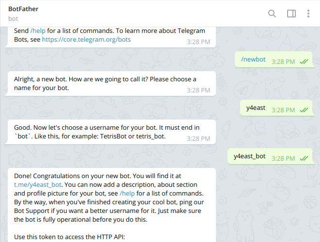
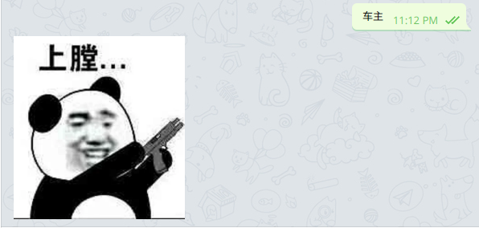
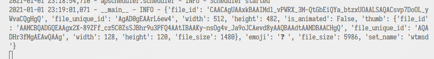
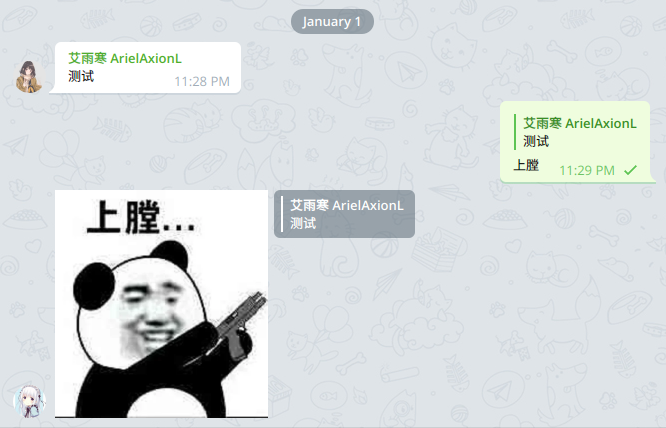

## 介绍
一个检测关键词并自动回复表情包的 `Telegram` 机器人。

## 开发
### 注册一个机器人
1. 访问 Telegram 的官方注册机器人 [@BotFather](https://t.me/BotFather) 。

2. 使用 `/newbot` 命令创建一个新的机器人。它会询问你所要创建机器人的名字 (nickname) 和用户名 (username, 以`_bot`结尾)，注册成功后会将机器人的 `TOKEN` 返回给你，而这个 `TOKEN` 用于告知服务器这个机器人就是（~~大明湖畔那个夏雨荷~~）对应注册的机器人。



```markdown
...
Use this token to access the HTTP API:
`<1145141919810:TheWholeSentenceIsToken>`
Keep your token secure and store it safely, ...
```

### 安装 Python 环境
> 官方网站: https://www.python.org/downloads

对于绝大多数 Linux 发行版来说从其自己的包管理器中安装 `Python` 即可（~~2021 年了应该都默认 Python3?)~~

Windows 则 Python 官方提供了安装器，记得把 `Python` 加到环境变量 (PATH) 的框给勾选上。

为了避免开发环境不干净对后续开发和使用系统造成影响，建议创建一个用于该机器人项目的[虚拟环境(virtual environment)](https://docs.python.org/zh-cn/3/tutorial/venv.html)

```fish
$ python -m venv .venv // 创建了一个名为 .venv 的隐藏文件夹
```

对于国内使用 PyPi 源速度不是很给力的情况，可以考虑替换镜像源为[清华源](https://mirrors.tuna.tsinghua.edu.cn/help/pypi/)

也可以写入默认配置文件 `~/.config/pip/pip.conf`（如果没有则[创建](https://pip.pypa.io/en/stable/user_guide/#config-file)）

```ini
[global]
index-url = https://pypi.tuna.tsinghua.edu.cn/simple
```

可以查看设置是否生效
```fish
$ pip config list 

global.index-url='https://pypi.tuna.tsinghua.edu.cn/simple'
```

创建虚拟环境后，您可以激活它，进入项目所在目录。

- 在 Windows 上，运行:
```cmd
tutorial-env\Scripts\activate.bat
```
- 在 Unix 或 MacOS 上，运行:
```bash
$ source tutorial-env/bin/activate
```
对于 `csh` 和 `fish shell` 分别对应名为 `activate.csh` 和 `activate.fish` 的脚本

### 安装软件包依赖
> [python telegram bot 项目地址](https://github.com/python-telegram-bot/python-telegram-bot)

```fish
$ pip install python-telegram-bot --upgrade
```

也可以将依赖导出到文件，便于开发迁移
```fish
$ pip freeze > requirements.txt 
```

### Coding Time
```python
def main():
    # 从环境变量中读取 TOKEN 减少硬编码可能带来的泄漏风险
    # 如果只是本地测试的话可以直接把 TOKEN 粘贴到程序中
    TOKEN = os.getenv('TELEGRAM_BOT_TOKEN')

    # Updater 是 Dispatcher 的实现，用于机器人数据交互的前端，
    # 负责更新消息队列并交付给其他调度程序
    updater = Updater(token=TOKEN, use_context=True)
    dispatcher = updater.dispatcher

    # 开始拉取信息
    updater.start_polling()

    # 响应终止信号 Ctrl+C
    updater.idle()

if __name__ == "__main__":
    main()
```

上述几行代码构成了整个机器人的基本框架，包含了机器人身份认证和开启机器人服务等。我们还需要向该框架内注册具体的方法，以实现所需功能。

```python
def start(update: Update, context: CallbackContext) -> None:
    """Send a message when the command /start is issued."""
    reply_text = "你好～\n"
    user = update.message.from_user

    if user.username is not None:
        reply_text += f"您的用户名是: {user.username}\n"

    reply_text += f"ID: {user.id}"

    update.message.reply_text(reply_text)

def help_command(update: Update, context: CallbackContext) -> None:
    """Send a message when the command /help is issued."""
    update.message.reply_text('这里是帮助命令')

def echo(update: Update, context: CallbackContext) -> None:
    """Echo the user message."""
    update.message.reply_text(update.message.text)

def main():
    token = os.getenv('TELEGRAM_BOT_TOKEN')
    updater = Updater(token=token, use_context=True)
    dispatcher = updater.dispatcher
    dispatcher.add_handler(CommandHandler("start", start_command))
    dispatcher.add_handler(CommandHandler("help", help_command))
    dispatcher.add_handler(MessageHandler(Filters.text & ~Filters.command, echo))
    updater.start_polling()
    updater.idle()
```

从 `Update` 中可以拿到消息的类型、具体内容、发送者等关键信息，从 `CallbackContext` 中可以获取机器人本身的一些信息等。在使用 `\` 开头的对应命令后就能进入到对应的方法，也可以对此进行类封装。

注意到除了 `CommandHandler` 之外还有其他类型的句柄如常规消息类的 `MessageHandler`、用于行内输入的的 `InlineQueryHandler` 等，请详见[上游 API 文档](https://python-telegram-bot.readthedocs.io/en/stable/telegram.html)。

回到需求，我们需要的检测关键词部分也是从 `Update` 中来，用关键词列表简单演示，当消息中包含关键词的时候发送一个表情，或者其他类型的回复[详见 Message 类文档](https://python-telegram-bot.readthedocs.io/en/stable/telegram.message.html?highlight=Message)。

```python
from telegram import Update, Sticker

# 临时创建一个表情量
sticker = Sticker(file_id="CAACAgUAAxkBAAIMOV_jA7I0IAABMbqNVNGkJWZNiDRT6QACiwIAArL6ew6tFsY1eQy9Lx4E",
    file_unique_id="AgADiwIAArL6ew4", width=480, height=512, is_animated=False)

def echo(update: Update, context: CallbackContext) -> None:
    keys_list = ["上膛", "车主", "特斯拉"]
    for item in keys_list:
        if item in update.message.text:
            msg = update.message
            msg.reply_sticker(sticker)
```



至此初步效果已经达成，剩下要解决的两个疑问就是：
- Sticker 的信息是怎么来的？
- 如何回复指定消息

#### Sticker 信息
可以添加一个专用于获取表情包信息的句柄

```python
def get_sticker(update: Update, context: CallbackContext) -> None:
    logger.info(update.message.sticker)

def main():
    ...
    dispatcher.add_handler(MessageHandler(Filters.sticker & ~Filters.command,       
        get_sticker))
    ...
```

为了便于理解这里在服务端后台直接输出表情包信息作为日志，对于一些要动态添加表情包和对应关键字的需求来说，一个轻便的可持久化数据才是更好的选择。创建 Sticker 实例的时候注意不要遗漏必要的传入参数。



#### 如何回复指定的消息
简单来说这就是一个套娃过程，从包含关键字消息的 `reply_to_message` 成员可以判断并拿到上一条回复的消息，回复拿到的上一条消息即可，从而实现精准打击（x

```python
    ...
    msg = update.message.reply_to_message

    if msg is not None:
        msg.reply_sticker(sticker)
    ...
```



## 结束
以简单的案例来介绍 Telegram 机器人的玩法，希望能够帮助到入门的萌新打造属于自己的机器人。（撒花 ~=o(*^▽^*)o~♪