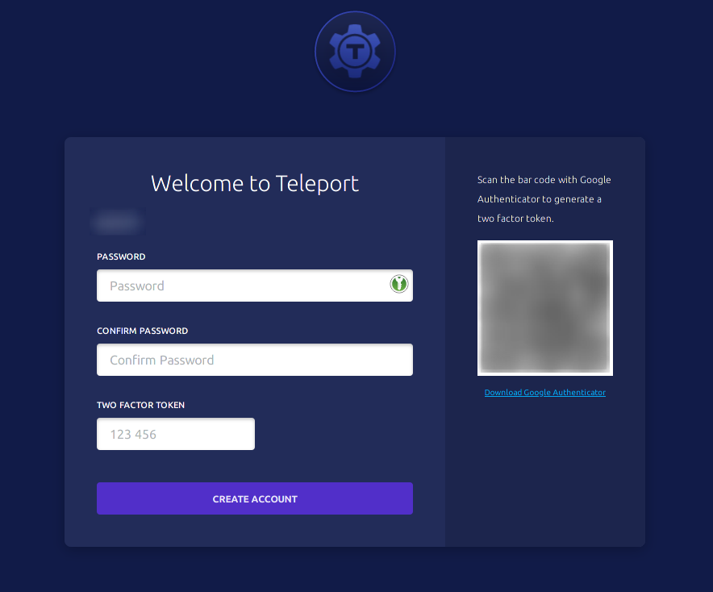
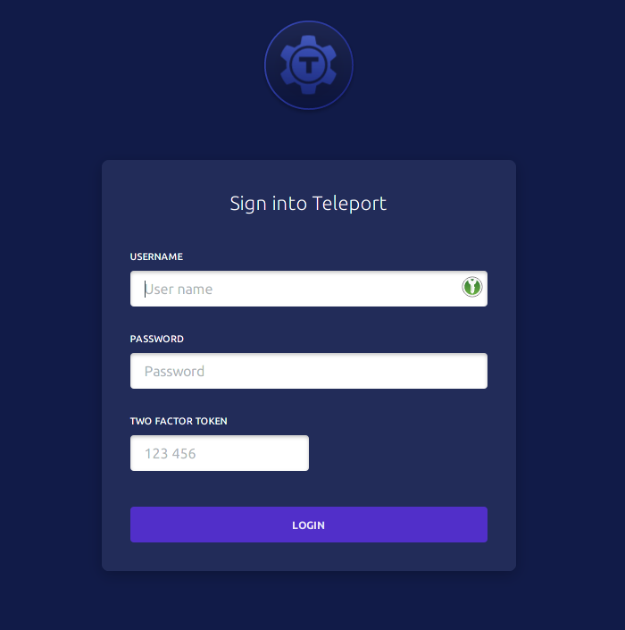
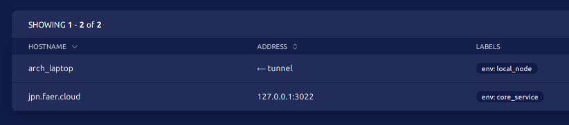

## 简介

常用于跨平台集群管理，提供多设备认证、远程操作和反向代理。

> 项目地址：[github.com/gravitational/teleport](https://github.com/gravitational/teleport)

> 官方网站：[goteleport.com](https://goteleport.com/teleport)

## 安装
有以下几种方式，单个可执行文件内已经包含 web 管理平台、服务端和客户端功能。(*Windows 目前仅支持客户端*)

- [可执行文件下载](https://gravitational.com/teleport/download/)
- [Docker 下载](https://quay.io/repository/gravitational/teleport?tab=tags)
- [编译安装](https://goteleport.com/teleport/installing)

## 快速配置

### 服务端及 Web 管理平台
```yaml
teleport:
    data_dir: /var/lib/teleport # 数据存放目录
auth_service:
    enabled: true
    cluster_name: "demo_cluster"
    listen_addr: 0.0.0.0:3025 # 认证监听地址
    tokens:
    - proxy,node,app:<nodes_auth_token> # 节点认证密令
ssh_service:
    enabled: true
    labels:
        env: staging
app_service:
    enabled: true
    debug_app: false
proxy_service:
    enabled: true
    listen_addr: 0.0.0.0:3023 # 反向代理监听地址
    web_listen_addr: 0.0.0.0:3080 # web 管理页面地址
    tunnel_listen_addr: 0.0.0.0:3024 # 隧道监听地址
    public_addr: <https://example.domain.org:3025> # 反向代理公共地址
    https_keypairs: # 本地测试时可不设置证书
        - key_file: <key_file_path>
        - cert_file: <cert_file_path>

```

*可由如下命令启用服务端进行测试，要点如下:*

- 在本地测试时即便没有填写 `https_keypairs` 也仍然需要在监听的 `web` 地址前面加上 `https://`，或者使用 `--insecure-no-tls` 命令行参数对 `http://` 进行访问。
- 如果配置中含有非对应权限目录或者证书文件，则调整到对应权限，如 `/var/lib/teleport` 仅限 `root` 权限访问，则需要调整到对应的权限再启动命令。
- 所有的登陆行文均在 `web_listen_addr` 所指示的地址发生。
- 注意证书所对应的域名与可访问的相同

```bash
$ teleport start --config teleport.yaml
```

`tctl` 是 `teleport` 的一个命令行管理工具，在 `teleport` 服务运行时，可以由它对用户、节点、密令等进行动态管理。

```bash
# 创建一个初始用户
$ tctl users add <username> <login_user, login_group> --config teleport.yaml 
```

添加好用户后可访问提示的地址，输入账户密码，用手机两步验证器扫码后填入验证码即可初始化成功。配置文件中支持除 `otp` 外还支持 `github auth` 认证等方式。

 

> 常用的两步验客户端
> - [Authy](https://authy.com/download/)
> - [Google Authenticator](https://www.google.com/landing/2step/)
> - [Microsoft Authenticator](https://www.microsoft.com/en-us/account/authenticator)

### 子节点
除了服务端平台自己可以作为节点外，还可以添加其他的子节点构成集群，大体上分为两类：
- 子节点有公网可以访问
- 非公网节点需要反向代理(`roles` 内需要含有 `proxy`)。

#### 静态子节点
静态子节点配置文件需要对应服务端里的地址和 `<nodes_auth_token>`，随后直接在节点上运行即可。

```yaml
teleport:
    nodename: "my_laptop"
    data_dir: /var/lib/teleport/
    auth_token: <nodes_auth_token>
    auth_servers:
        - <https://example.domain.org:3025> # 认证地址
proxy_service:
    enabled: false # 本地子节点暂时无需启动反向代理服务端
ssh_service:
    enabled: true
    labels:
        env: local_node
auth_service:
    enabled: false # 本地子节点暂时无需启动认证服务端
```

#### 动态子节点
动态子节点需要在服务端上进行添加，由以下命令生成一个临时的 `token` 以添加子节点。

```bash
$ tctl nodes add --roles=node,proxy --ttl=5m --config teleport.yaml
```

得到形如下方的命令：

```bash
$ teleport start \
    --roles=node,proxy \
    --token=<random_token> \
    --auth-server=<https://example.domain.org:3025>
```

添加成功后可以在 `web` 界面内看到所有的节点。


### 客户端
安装包内自带一个名为 `tsh` 的可执行文件，用于命令行认证和登陆

```bash
$ tsh login --proxy=<https://example.domain.org:3025> --user=<username> 
```

登陆后可以使用 `ls` 命令查看已添加的节点

```bash
$ tsh ls

Node Name      Address        Labels           
-------------- -------------- ----------------
demo_cluster   127.0.0.1:3022 env=core_service
my_laptop      ⟵ Tunnel      env=local_node 
```

使用 `ssh` 来登陆节点终端
```bash
$ tsh ssh <node_name>
```

## 高级配置
### 配合 K8S 管理服务
TBC...

---

> [Banner Artwork](https://wallhaven.cc/w/ymz1qx)
